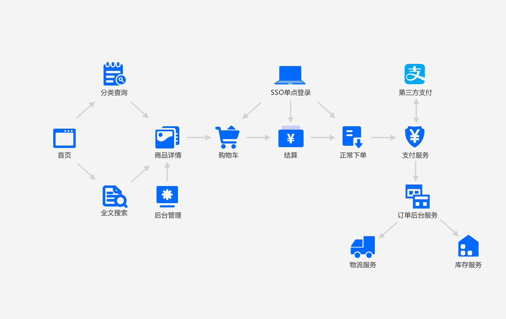

## 1. 产品需求梳理




设计流程简单的原因有几点：

- 考虑到顾客购买是一种冲动性的消费，如果流程过长，就会导致顾客购买时间过长，他就会冷静下来：我该不该买。出于商业性的考虑一般都会希望用户尽快购买
- 流程简单，用户购买不需要导购

一个系统包括4个架构的演进体现

业务->应用->技术->数据

在业务逻辑上2个方面：

- 选好技术栈
- 填充有效的业务代码

## 2. 系统流量分析


做传统项目久了，互联网的数据流转内容就不是很清晰了，流量一定先到DNS（域名解析服务）

- DNS：做负载均衡（跨机房的场景下）不能进行实时的服务发现（DNS会做多层的路由缓存），DNS下面挂载的网关一定要是高可用的

- 网关要HA，SLB--(N1,N2,N3)，SLB（对接应用），Nginx+Keepalived（会出现脑裂的风险）

- CDN：（贵）按流量收费的，是一个缓存服务，一个系统上面有大量的图片和视频?v=20200605

- **应用服务：考虑无状态**，服务化，实际的业务系统 ，中心化到集群节点

- 数据库是我们整个系统最脆弱的环节，CAP（C: 一致性，A: 可用性，P：分区容错性，就是一个节点挂了，不影响整体服务的可用），分布式数据库 AP（可用与分区容错），<mark>数据库做主从，同步有三个状态：异步，同步，**半同步**</mark>

  命令行查询耗时长的session连接，kill掉

  ```shell
  mysql> top
  
  mysql> kill process_id
  ```

  > 数据库如何提前预防呢？

  slow_log 慢查询日志要打开，explain执行计划跑一下

  将数据库进行保护，80%的查询都在缓存层进行访问（从数据库push到缓存），100%都在缓存层？（从缓存推到数据库）

  <mark>问题：</mark>

  如何保证数据库的数据能100%到达缓存副本（MySQL--中间层MQ--Redis之间能直接通信吗？通过消息队列将消息进行应答ACK，如果应答失败进行重试，重试失败就放入死信队列，这个死信队列用于人工补偿，**最后达成最终一致性**）

  数据库可不可以做分库分表呢？单个数据库的单张表不超过5kw就不用分表，主键一定要用有序id，千万不要用uuid（全局用snow_id），因为我们的数据库使用innodb引擎，innodb使用索引组织表的形式(表数据的存放完全依赖于主键的排序，表数据和索引存放在同一个文件，你插入一个无序的id，你所有的索引组织结构就会因为一个无序的id而更新，相当于插入新的数据触发索引重排)

> 总结

1、计划型的：动静分离CDN，扩容（k8s动态扩容），缓存（Redis集群slot:16384分散的足够开），索引

一定我们的系统出现意向不到的流量激增：

2、限流：一般都是在网关这一层做，是保证系统生存的最后底限（Nginx，Gateway，Guava，Redis+Lua）50w+ （通过jmeter压测，会乐观20%到30%左右），最大60w

DDoS（流量攻击）可用通过限流来进行简单的处理，通过CDN供应商来处理：cloudflare （抗流量攻击）

如果是普通用户流量激增，返回一个静态页面html，并把这个html放到CDN，这个html可以是一个首页

3、降级：两种场景

- 主辅流程的辅助流程进行降级，直接停用
- 核心业务流程如果出现熔断，这个时候服务第一级降级就需要直接访问对端底层数据了，如果还访问不了再次熔断调用一个本地存根或者本地提示

4、熔断：Hystrix，Sentinel，快速失败后直接服务降级（访问我们本地的stub）

 服务降级一般会做两到三级(多层fallback调用)：购物车module调用商品详情module，第一级（降级）直接穿透访问对端服务的数据

## 3. 应用架构设计


- 对于整个系统我们直接使用分布式微服务的架构体系来进行模块拆分，领域设计

- 基于SpringCloud Netflix全家桶和后续补充的SpringCloud Alibaba的Nacos和Sentinel，可以根据自己的需要进行替换

- 对于电商系统来讲，尤其要考虑并发访问和流量激增，就直接引入

  - Redis进行热点数据存储，购物车缓存
  - ElasticSearch搜索引擎支持内容的快速展示和搜索
  - 使用SpringCloud将拆分好的服务模块进行治理

  

## 4. 管理系统后端应用搭建

由于后台商品管理系统主要是针对企业内部员工，主要业务集中在商品管理，类目管理，订单管理，评价管理，活动管理等信息管理内容，这个后端系统的服务度主要集中在业务功能的CRUD上（所有的报表查询都走从库），不用考虑过多的并发和负载情况，只要要对数据进行定时的备份和转储，保证数据的完整性即可，数据相关的内容在MySQL搭建时完成即可

> 架构设计进行落地的核心：识别业务或系统的复杂度

第一思考开源项目：

```shell
https://github.com/macrozheng/mall
# 码云
https://gitee.com/macrozheng/mall?_from=gitee_search
```

使用的数据库结构

```shell
# 1、产品管理服务
pms_product  										      #产品信息
pms_product_category						      #类目信息
pms_brand												      #品牌
pms_member_price								      #会员等级对应产品优惠价目表
pms_product_attribute_category        #产品属性所属分类统计
pms_product_attribute						      #产品备选属性
pms_product_attribute_value			      #产品选择的具体属性
pms_sku_stock										      #产品属性相关的值

# 2、首页服务
sms_home_advertise							      #首页banner图
sms_flash_promotion										#活动列表
sms_flash_promotion_product_relation  #活动关联产品信息  

# 3、订单管理服务
oms_cart_item										      #购物车信息
oms_order												      #订单详情
oms_order_item									      #订单商品详情

# 4、会员管理服务
ums_member											      #会员信息
```

修改mall-admin的application-dev.yaml配置的aliyun部分为自己的OSS地址

```yaml
aliyun:
  oss:
    endpoint: oss-cn-zhangjiakou.aliyuncs.com # oss对外服务的访问域名
    accessKeyId: LTAI4FzicNpcW2NvwVX2sML8 # 访问身份验证中用到用户标识
    accessKeySecret: aCFEVv1ekXc6Pth55lrCDeqkGz7VR0 # 用户用于加密签名字符串和oss用来验证签名字符串的密钥
    bucketName: icoding-mall # oss的存储空间
    policy:
      expire: 300 # 签名有效期(S)
    maxSize: 10 # 上传文件大小(M)
    callback: http://39.98.190.128:8080/aliyun/oss/callback # 文件上传成功后的回调地址
    dir:
      prefix: mall/images/ # 上传文件夹路径前缀
```

上面的accessKeyId和accessKeySecret需要创建RAM的用户并授权后生成

项目启动需要设置好三个外部资源

- 数据库连接正确并初始化好脚本资源
- redis服务启动正常
- aliyun的oss配置完成

以上三个设置好后就可以启动mall-admin服务了，启动完成后可以通过以下swagger服务来验证

```shell
http://localhost:8080/swagger-ui.html
```


## 5. 商品管理前端配置

管理系统前端github地址：

```shell
https://github.com/macrozheng/mall-admin-web
```

这个下载下来后要修改一下里面的oss的公共访问地址，可以全文搜索一下

```shell
http://macro-oss.oss-cn-shenzhen.aliyuncs.com
```


替换成我们自己的oss的bucket地址

```shell
icoding-mall.oss-cn-zhangjiakou.aliyuncs.com
```

启动项目

```shell
# node安装
npm install
# 运行启动前端
npm run dev
# 如果报sass错，执行下面内容
npm install node-sass --save-dev --registry=https://registry.npm.taobao.org
```

启动后访问地址如下

```shell
http://localhost:8090
账号密码：admin/macro123
```


## 6. 微服务的拆分原则

单体应用-->集群（无状态）-->分布式（微服务实现分布式：<mark>单一原则</mark>）

**拆**：不要上来就拆

如果面试官提问，如果让你构建一个新的电商业务系统，你如何设计：一上来就使用SpringCloud的技术栈进行系统解构来进行系统架构（80分）开放性问题？做项目不只是要考虑技术栈，还有考虑业务

有很多不确定因素（资源、用户基数有多大、时间节点、公司有什么公共技术平台可以使用），

- 你的系统要以最快的时间完成迭代的前提是为后续扩展留出相应的接口可和扩展的空间，要具有一定的分布式的结构，但是拆得越细，复杂度就上升，项目时间就拉长。

- 前期考虑使用单体和集群的方式快速实现业务系统，然后为将来的分布式留出空间。
- 后期用户基数变大（1万到几十万），就开始考虑服务的拆分 ，引入微服务的组件，逐步的更新已上线的系统，慢慢的形成微服务的系统
- 做项目设计更多的是打开思路和考虑到不同场景下的应用的一个阶段和状态，而不是一上来就干

微服务的拆分原则没有一个绝对正确的方案，根据业务场景来进行拆分的，后期业务深入原来的服务模块也会被再次拆分。

### 压力模型拆分

压力模型简单来说就是根据用户的访问量，<font color=red>识别高并发的业务量，尽可能独立出来一个服务部署</font>

在具体在做的时候拆分三个维度

- **高频高并发场景**：比如商品详情，所以他的QPS一定极高
- **低频高并发场景**：比如秒杀，闪购，大量后天类目数据初始化
- **低频流量场景**：对服务进行降级的时候，你从哪里入手？先将低频流量的服务进行降级

> 关于服务无状态化，业务有状态
>
> 服务的无状态化就是冗余部署的多个服务模块(进程)，使其完全对等。也就是部署多个相同服务，请求到任一服务的处理结果是一样的。这些模块不存储业务的上下文信息，比如session、登录、业务上下文相关的信息。只会根据每次请求携带的数据进行相应的业务处理。
> 实质这些业务相关的信息是会存放在统一的一个地方，比如缓存、es等等。

### 业务模型拆分

- 主链路拆分

  可以识别的主链路，和隐藏的主链路（比如优惠计算）

  - 异常容错：建立多层次的降级策略，合理应用熔断技术实现快速失败（永远记住我们的技术是为业务场景服务的，你必须要能识别你的技术是在为哪个业务场景服务）
  - 资源调配：就可以在资源不够的情况下，将资源倾斜给主链路
  - 服务隔离：没有区分主链路的情况下，非主业务关注度不高，集成和回归测试不足，就会导致非主业务影响主链路（你的非主业务和主业务共享同一套资源）

- 领域模型拆分各自负责各自的事情，不要互相影响(例子：订单系统、购物车系统、首页信息、登录注册、用户管理，你首页挂了，不影响订单系统)，解耦非常高

  所谓领域模型就是一套各司其职的服务集合

  <mark>中台也要区分：技术中台，业务中台(多个产品线，有可能每条产品线都会搭建一个业务中台)</mark>，每个业务中台共性的东西都给可以下沉到技术中台，减少复杂度

- 按用户群体来拆分（举例：前端用户、后端用户、运营采购不同的角色）

- 前后台业务分离

### 中台的理解

中台，是基于业务前台和数据后台之间的那部分

- 业务前台：具体面向用户的业务逻辑和UI（用户的交互接口）/UE（用户视觉 ）组织形式，业务载体
- 数据后台：数据具体存放的地方

业务前台举例：公司做对欧美的出口电商业务（极简风格），新增日韩出口电商业务（细节风格 ）（80%都是这部分的内容，做有效的业务代码）

共性的东西：

这两个业务前台是不是都要用到：Redis（16个db，springboot连接时可以选择db0到db15）、ELK（elasticSearchTemplate）、RabbitMQ（RocketMQ）、日志处理(filebeat->Kafka->logstash->elasticsearch)、服务注册发现(eureka 、nacos)、配置中心(springconfig+bus，nacos)，做一层封装将底层差异屏蔽，就是要分开提供不同的业务中台的接口封装

业务中台：业务公共的部分进行下沉，让业务前台更多时间关心在数据的组织、渲染、流转

中台的目的：**降本增效**

中台提供一些统一的业务组件，业务系统只关心业务就可以了

> 如何推行中台落地：

- 中台技术人员发现系统中冗余的部分并进行**无状态化设计**

- 中台技术人员把你的客户定位成业务开发人员，目标是为他们赋能

- 业务人员要主动将共性业务下沉到中台

- 技术中台一定要给业务提供一个服务版本列表

> 中台是以什么的方式提供给业务使用？

- 服务注册的方式，然后调用服务（http）

- 技术中台一定要给业务提供一个服务版本列表（就跟springboot 的parent一样，分很多的版本 ）


## 7.当前系统架构拆分方法

结合业务领域和主业务链来进行模块拆分

本次使用springboot+thymeleaf模版引擎来渲染前端展示，主要精力集中在服务治理上

将系统整个拆分为以下业务领域

- imall-web：整个系统的展示端，总的consumer，就是系统的前端

- imall-api：公共接口、实体、MyBatis的相关逆向工程（mapper，pageHelper）

  我实战中使用的是MyBatis-plus

- imall-index：首页服务，主要涉及类目，banner轮播图

- imall-search：产品搜索、列表页面、详情页

- imall-cart：购物车服务

- imall-order：订单服务

- imall-payment：第三方支付对接服务（支付宝给你Jar包，示例代码，按照文档要求的参数进行调用即可，提供一个回调接口）

- imall-activity：活动服务，比如秒杀，闪购

- imall-auth：权限验证，jwt/oauths

- imall-customer：用户中心服务，登录，注册

- imall-admin-web: 后台管理，使用开源项目的系统

所有的服务都以微服务的方式进行交互和对接实现系统的高内聚低耦合

## 8.项目框架搭建


### 服务注册中心

可以使用eureka和nacos,

Eureka 的高可用看我这篇文章：[/springcloud/2019/11/12/springcloud-ha-eureka.html](/springcloud/2019/11/12/springcloud-ha-eureka.html)

eureka集群：CAP？CP/AP，是AP

eureka的服务自保和服务剔除有什么区别？

服务自保: 某一时刻，某一服务不能使用了，eureka不会立刻清理，但依旧会保持微服务的实例信息。心跳检测，微服务每30秒向eureka server发送心跳， eureka   server若90s之内都没有收到某个客户端的心跳，则认为此服务出了问题， 会从注册的服务列表中将其删除，并通知订阅它的客户端更新服务列表，而且还会通知其他eureka server更新此信息。

导入依赖

```xml
<dependencies>
  <dependency>
    <groupId>org.springframework.cloud</groupId>
    <artifactId>spring-cloud-starter-netflix-eureka-server</artifactId>
  </dependency>
</dependencies>
```

application.yml配置

```yaml
eureka:
  instance:
    hostname: localhost
  client:
    register-with-eureka: false
    fetch-registry: false
  server:
    enable-self-preservation: false #强制关闭服务自保开关,默认开启
    eviction-interval-timer-in-ms: 30000 #服务剔除的间隔时间
    renewal-percent-threshold: 0.9 #只剔除90%的无用服务
```

我这里使用nacos作为服务注册中心

### ORM框架

可以使用mybatis + tk mapper 做逆向

也可以使用mybatis-plus 

项目中我选择了第二个


