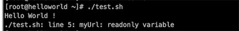
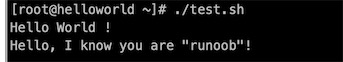

 文章内的所有脚本均在linux环境下执行

## 1、第一个Shell脚本

```shell
[root@helloworld ~]# vim test.sh
#!/bin/bash
echo "Hello World !"
```

\#! 是一个约定的标记，它告诉系统这个脚本需要什么解释器来执行，即使用哪一种 Shell。echo 命令用于向窗口输出文本。

运行脚本的两种方法

- **作为可执行程序**

  ```shell
  chmod +x ./test.sh  #使脚本具有执行权限
  ./test.sh  #执行脚本
  ```

- **作为解释器参数**

  ```shell
  /bin/sh test.sh
  /bin/php test.php
  ```

  注意：这种方式运行的脚本，不需要在第一行指定解释器信息，写了也没用。

## 2、Shell变量

### 定义变量

```shell
# 注意，变量名和等号之间不能有空格,
# 变量命名只能使用英文字母，数字和下划线，首个字符不能以数字开头。
# 1、显示赋值变量
your_name="runoob.com"
# 2、for语句给变量赋值
for file in `ls /etc`
或者
for file in $(ls /etc)
```

### 使用变量

```shell
your_name="qinjx"
echo $your_name  # 不加花括号
echo ${your_name} # 加花括号可以帮助解释器识别变量的边界
# 下面这种情况必须加花括号
for skill in Ada Coffe Action Java; do
    echo "I am good at ${skill}Script"
done

# 重新赋值
your_name="tom"
echo $your_name
your_name="alibaba"
# 注意，第二次赋值的时候不能写$your_name="alibaba"，因为变量不能有特殊字符，$是使用变量
```

### 只读变量

```shell
#!/bin/bash
myUrl="https://www.google.com"
readonly myUrl
myUrl="https://www.runoob.com"
```

执行脚本，修改只读变量报错




### 删除变量

```shell
# unset 删除变量，不能删除只读变量
myUrl="https://www.runoob.com"
unset myUrl
echo $myUrl # 变量已删除，没有输出
```

## 3、Shell字符串

```shell
# 可以单引号和双引号
str1='this is a string'
# 使用\进行转义字符
your_name='runoob'
str2="Hello, I know you are \"${your_name}\"! \n"
echo -e $str2
```

执行脚本




**拼接字符串**

```shell
your_name="runoob"
# 使用双引号拼接
greeting="hello, "$your_name" !"
greeting_1="hello, ${your_name} !"
echo $greeting  $greeting_1
# 使用单引号拼接
greeting_2='hello, '$your_name' !'
greeting_3='hello, ${your_name} !'
echo $greeting_2  $greeting_3
```

输出结果：建议使用双引号拼接字符串

```shell
hello, runoob ! hello, runoob ! 
hello, runoob ! hello, ${your_name} !
```

**字符串长度**

```shell
string="abcd"
echo ${#string} #输出 4
```

**提取子字符串**

```shell
# 第 2 个字符开始截取 4 个字符,索引初始值为0
string="runoob is a great site"
echo ${string:1:4} # 输出 unoo
# 查找字符 i 或 o 的位置
echo `expr index "$string" io`  # 输出 4 发现位置是从1开始计算的， 注意 ` 是反引号，而不是单引号 '
```

## 4、Shell 数组

```shell
# 1、定义数组，格式：数组名=(值1 值2 ... 值n)
# 用括号来表示数组，数组元素用"空格"符号分割开
array_name=(value0 value1 value2 value3)
# 单独定义数组的各个分量
array_name[0]=value0
array_name[1]=value1
array_name[n]=valuen

# 2、读取数组，格式：${数组名[下标]}
valuen=${array_name[n]}
# 使用 @ 符号获取数组中的所有元素，输出所有的元素
echo ${array_name[@]}

# 3、获取数组长度，与获取字符串长度的方法相同
length=${#array_name[@]}  # 区别，多了一个 # 号
length=${#array_name[*]}  # 使用 * 号也可以获取数组的长度
lengthn=${#array_name[n]} # 获取第n个元素的字符串长度
```

## 5、Shell 注释

```shell
使用 # 开头的行就是注释，如
#--------------------------------------------
# 这是一个注释
# author：菜鸟教程
# site：www.runoob.com
# slogan：学的不仅是技术，更是梦想！
#--------------------------------------------

多行注释
:<<EOF
注释内容...
注释内容...
注释内容...
EOF
```

## 6、Shell 传递参数

向脚本传递参数，格式为：**$n**。**n** 代表一个数字，1 为执行脚本的第一个参数，2 为执行脚本的第二个参数，以此类推……

编写脚本 tesh.sh

```shell
#!/bin/bash
# author:菜鸟教程
# url:www.runoob.com

echo "Shell 传递参数实例！";
echo "执行的文件名：$0";
echo "第一个参数为：$1";
echo "第二个参数为：$2";
echo "第三个参数为：$3";
```

执行脚本

```shell
$ ./test.sh 1 2 3
```


