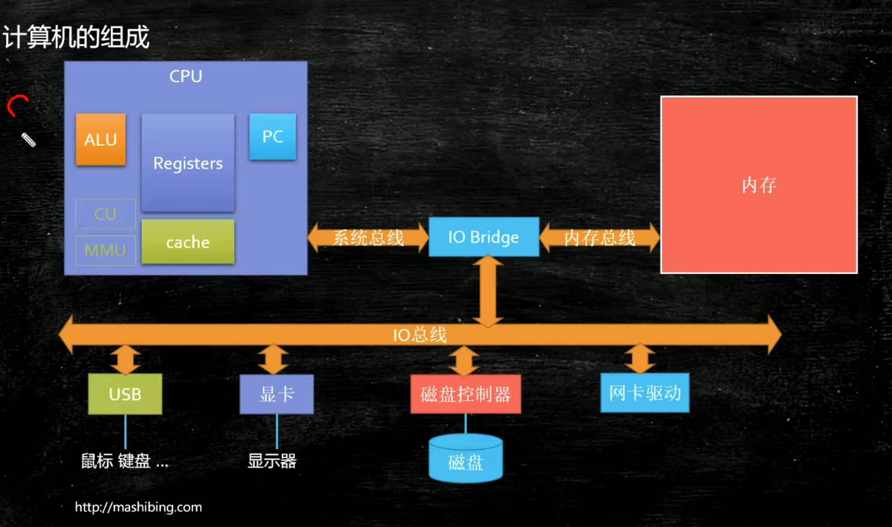
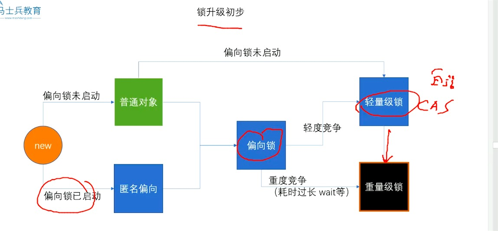
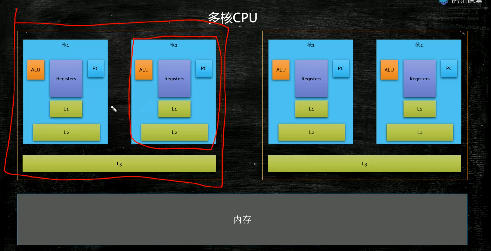
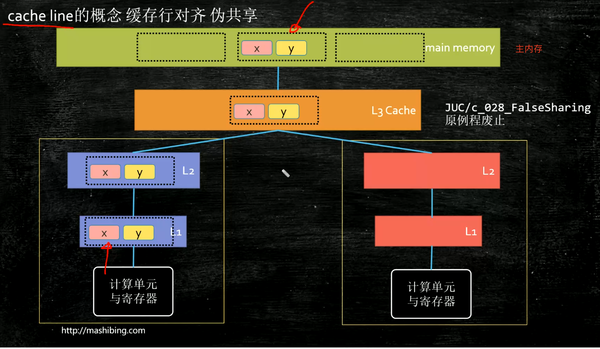
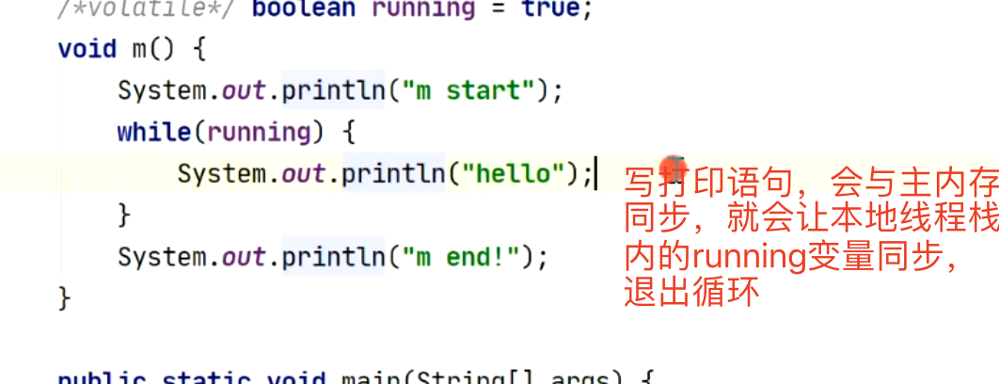
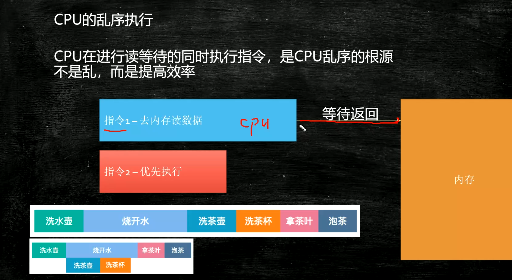
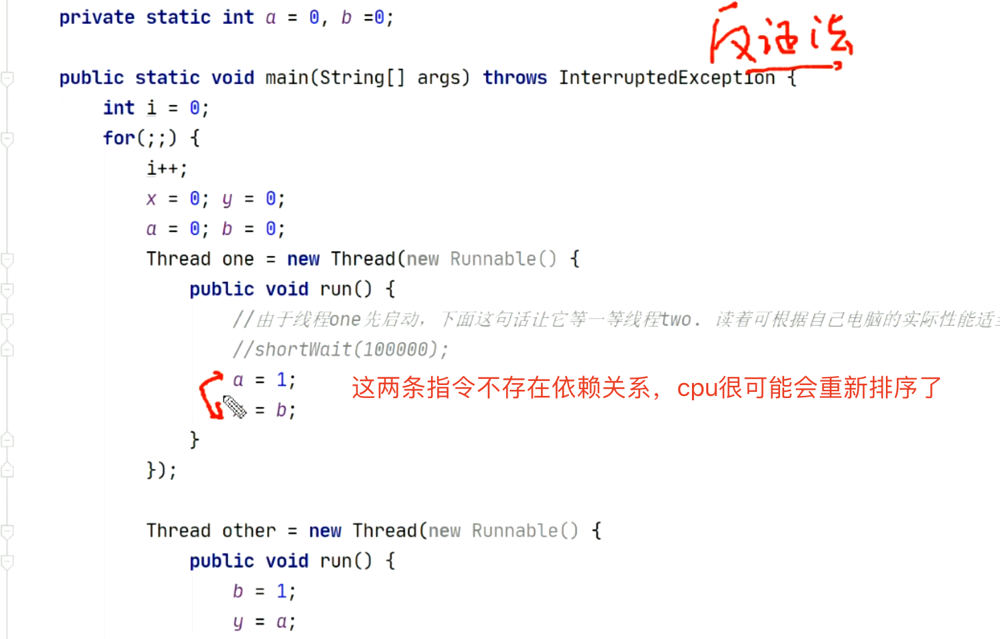
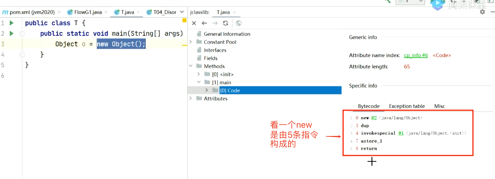
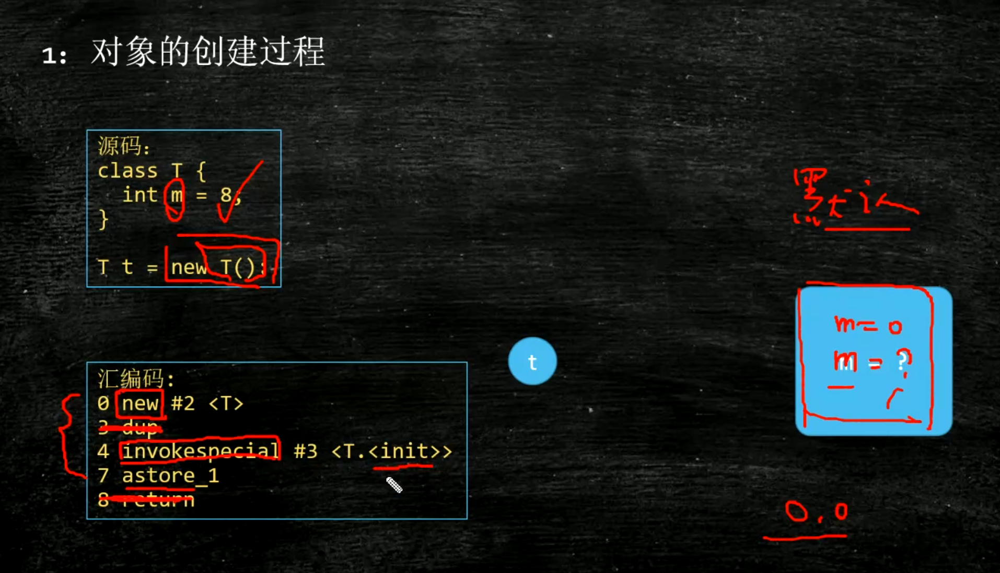
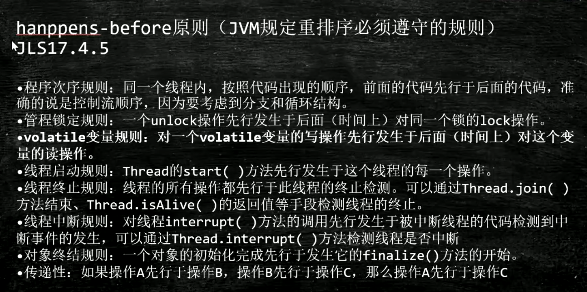

## 1、程序运行的底层原理

- Registers是存数据的，

- ALU是计算逻辑单元

- PC 程序计数器，记录下一条指令，存储指令地址
- 线程的执行进度保存在cache里

  a=2+3 ->放入内存->2和3读进registers->ALU->计算结果写回内存->PC 指向下一条指令

OS管理那个线程给CPU处理，它把指令扔给CPU接待，CPU比内存快100倍，所以为了不浪费cpu资源，会有很多线程在跑。

线程越多，线程切换就越多（时间浪费），反而会影响性能，所以不是线程越多越好，它有一个合适的值

重量级锁：需要OS系统调度管理的锁

> Synchronized

3层缓存，工业实践是性能最好的结构

> 多核CPU

一颗cpu有多核，缓存速度 L1>L2>L3 

内存放数据到L1L2L3缓存是一块数据放的，一块数据的大小目前是64个字节

Long 8个字节，int 4个字节，一个内存块（缓存行）是64个字节，能装8个long类型的值

> Volatile 修饰的内存，保证可见性

指令之间不能存在依赖，cpu才会去重排，证明的代码

new创建一个对象是由5条指令构成的

对象的创建过程

- new 分配内存空间
- astore 指向内存空间
- invokespecial init 初始化构建对象

> volatie 禁止指令重排

