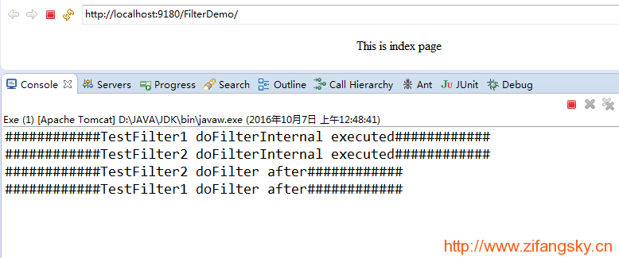
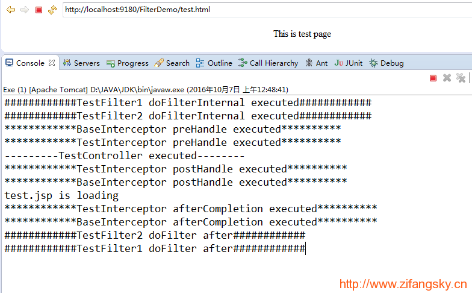
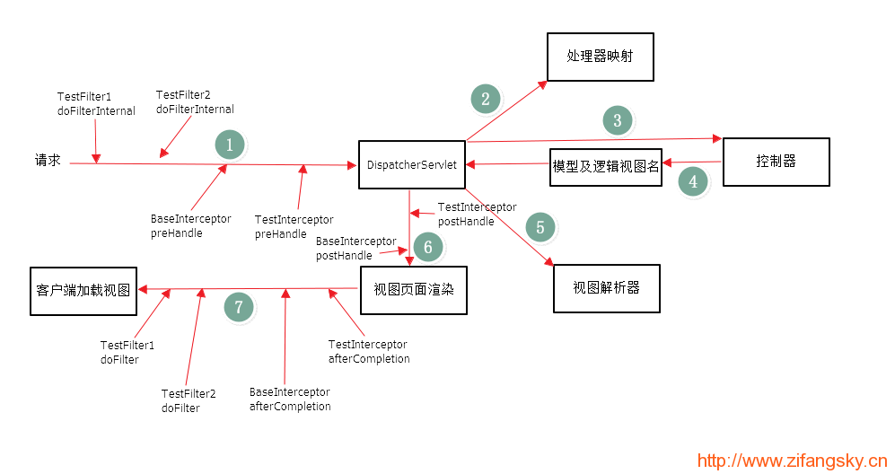

## 1.简介

### 过滤器filter

依赖于servlet容器，在实现上基于函数回调，可以对几乎所有请求进行过滤，但是缺点是一个过滤器实例只能在容器初始化时调用一次。使用过滤器的目的是用来做一些过滤操作，获取我们想要获取的数据，比如：在过滤器中修改字符编码；在过滤器中修改HttpServletRequest的一些参数，包括：过滤低俗文字、危险字符等

关于过滤器的一些用法可以参考写过的这些[文章](http://www.07net01.com/2015/07/860262.html)：

- 继承HttpServletRequestWrapper以实现在Filter中修改HttpServletRequest的参数：https://www.zifangsky.cn/677.html

- SpringMVC中使用过滤器（Filter）过滤容易引发XSS的危险字符：https://www.zifangsky.cn/683.html

### 拦截器interceptor

依赖于web框架，在SpringMVC中就是依赖于SpringMVC框架。在实现上基于[Java](http://www.07net01.com/tags-Java-0.html)的反射机制，属于面向切面[编程](http://www.07net01.com/)（AOP）的一种运用。由于拦截器是基于web框架的调用，因此可以使用Spring的依赖注入进行一些业务操作，同时一个拦截器实例在一个controller生命周期之内可以多次调用。但是缺点是只能对controller请求进行拦截，对其他的一些比如直接访问静态资源的请求则没办法进行拦截处理

关于拦截器的一些用法可以参考我写过的这些文章：

- 在SpringMVC中使用拦截器（interceptor）拦截CSRF攻击（修）：https://www.zifangsky.cn/671.html

- SpringMVC中使用Interceptor+[cookie](http://www.07net01.com/tags-cookie-0.html)实现在一定天数之内自动登录：https://www.zifangsky.cn/700.html

## 2.多个过滤器与拦截器的代码执行顺序

如果在一个项目中只有一个拦截器或者过滤器，那么理解起来是比较容易的。但是我们是否思考过：如果一个项目中有多个拦截器或者过滤器，那么它们的执行顺序应该是什么样的？或者再复杂点，一个项目中既有多个拦截器，又有多个过滤器，这时它们的执行顺序又是什么样的呢？下面举例

### 定义过滤器

```java
// 过滤器1
package cn.zifangsky.filter;

import java.io.IOException; 
import javax.servlet.FilterChain;
import javax.servlet.ServletException;
import javax.servlet.http.HttpServletRequest;
import javax.servlet.http.HttpServletResponse; 
import org.springframework.web.filter.OncePerRequestFilter; 

public class TestFilter1 extends OncePerRequestFilter {
	protected void doFilterInternal(HttpServletRequest request, 				
    HttpServletResponse response, FilterChain filterChain)
		throws ServletException, IOException {
		//在DispatcherServlet之前执行
		system.out.println("############TestFilter1 doFilterInternal executed############");
			filterChain.doFilter(request, response);
			//在视图页面返回给客户端之前执行，但是执行顺序在Interceptor之后
			System.out.println("############TestFilter1 doFilter after############");
			try {
				Thread.sleep(10000);
			} catch (InterruptedException e) {
				e.printStackTrace();
			}
		}
}

// 过滤器2
package cn.zifangsky.filter;

import java.io.IOException;
import javax.servlet.FilterChain;
import javax.servlet.ServletException;
import javax.servlet.http.HttpServletRequest;
import javax.servlet.http.HttpServletResponse;
import org.springframework.web.filter.OncePerRequestFilter;

public class TestFilter2 extends OncePerRequestFilter {
	protected void doFilterInternal(HttpServletRequest request, HttpServletResponse response, FilterChain filterChain)throws ServletException, IOException {
		System.out.println("############TestFilter2 doFilterInternal executed############");
		filterChain.doFilter(request, response);
		System.out.println("############TestFilter2 doFilter after############");
	}
}
```

在web.xml注册中注册两个过滤器

```xml
<!-- 自定义过滤器：testFilter1 -->   
<filter>  
  <filter-name>testFilter1</filter-name>  
  <filter-class>cn.zifangsky.filter.TestFilter1</filter-class>  
</filter>  
<filter-mapping>  
  <filter-name>testFilter1</filter-name>  
  <url-pattern>/*</url-pattern>  
</filter-mapping>  
<!-- 自定义过滤器：testFilter2 -->   
<filter>  
  <filter-name>testFilter2</filter-name>  
  <filter-class>cn.zifangsky.filter.TestFilter2</filter-class>  
</filter>  
<filter-mapping>  
  <filter-name>testFilter2</filter-name>  
  <url-pattern>/*</url-pattern>  
</filter-mapping>  
```

### 定义拦截器

拦截器`BaseInterceptor`

```java
package cn.zifangsky.interceptor;

import javax.servlet.http.HttpServletRequest;
import javax.servlet.http.HttpServletResponse; 
import org.springframework.web.servlet.HandlerInterceptor;
import org.springframework.web.servlet.ModelAndView; 

public class BaseInterceptor implements HandlerInterceptor{	
	/**
	 * 在DispatcherServlet之前执行
   */
  public boolean preHandle(HttpServletRequest arg0,HttpServletResponse 			arg1, Object arg2) throws Exception {
    System.out.println("************BaseInterceptor preHandle 		 executed**********");
    return true;
  }
 
	/**
	 * 在controller执行之后的DispatcherServlet之后执行
	 * */
  public void postHandle(HttpServletRequest arg0, HttpServletResponse arg1, Object arg2, ModelAndView arg3)throws Exception {
    System.out.println("************BaseInterceptor postHandle 		executed**********");
    }
	
  /**
  * 在页面渲染完成返回给客户端之前执行
	 * */
  public void afterCompletion(HttpServletRequest arg0, 			HttpServletResponse arg1, Object arg2, Exception arg3)throws Exception 	{
      System.out.println("************BaseInterceptor afterCompletion executed**********");
  //		Thread.sleep(10000);
   } 
}
```

拦截器`TestInterceptor`

```java
package cn.zifangsky.interceptor; 
import javax.servlet.http.HttpServletRequest;
import javax.servlet.http.HttpServletResponse;
import org.springframework.web.servlet.HandlerInterceptor;
import org.springframework.web.servlet.ModelAndView;
 
public class TestInterceptor implements HandlerInterceptor {
  // 在DispatcherServlet之前执行
public boolean preHandle(HttpServletRequest arg0, HttpServletResponse arg1, Object arg2) throws Exception {
	System.out.println("************TestInterceptor preHandle executed**********");
    return true;
}
 
  // 在controller执行之后的DispatcherServlet之后执行
public void postHandle(HttpServletRequest arg0, HttpServletResponse arg1, Object arg2, ModelAndView arg3)			throws Exception {
		System.out.println("************TestInterceptor postHandle executed**********");
}
 
  // 在页面渲染完成返回给客户端之前执行
public void afterCompletion(HttpServletRequest arg0, HttpServletResponse arg1, Object arg2, Exception arg3)throws Exception 	{
		System.out.println("************TestInterceptor afterCompletion executed**********");
	}
}
```

在SpringMVC的配置文件中注册这两个拦截器：

```xml
<!-- 拦截器 -->
<mvc:interceptors>
  <!-- 对所有请求都拦截，公共拦截器可以有多个 -->
  <bean name="baseInterceptor" class="cn.zifangsky.interceptor.BaseInterceptor" />
  
  <mvc:interceptor>		
    <!-- 对/test.html进行拦截 -->
    <mvc:mapping path="/test.html"/>
    <!-- 特定请求的拦截器只能有一个 -->
    <bean class="cn.zifangsky.interceptor.TestInterceptor" />
  </mvc:interceptor>
</mvc:interceptors>
```

### 定义controller

```java
package cn.zifangsky.controller;
 
import org.springframework.stereotype.Controller;
import org.springframework.web.bind.annotation.RequestMapping;
import org.springframework.web.servlet.ModelAndView;
 
@Controller
public class TestController {
	@RequestMapping("/test.html")
	public ModelAndView handleRequest(){
		System.out.println("---------TestController executed--------");
		return new ModelAndView("test");
	}
}
```

### 定义一个jsp页面

```jsp
<%@ page language="java" contentType="text/html; charset=UTF-8"
    pageEncoding="UTF-8"%>
<%
String path = request.getContextPath();
String basePath = request.getScheme()+"://"+request.getServerName()+":"+request.getServerPort()+path+"/";
%>    
<html>
<head>
<meta http-equiv="Content-Type" content="text/html; charset=UTF-8">
<base href="http://983836259.blog.51cto.com/7311475/">
<title>FilterDemo</title>
</head>
<body>
<%
	System.out.println("test.jsp is loading");
	%>
	<div align="center">
		This is test page
	</div>
</body>
</html>
```

### 测试

启动此测试项目，浏览器访问：http://localhost:9180/FilterDemo/，控制台中输出如下：




这就说明了过滤器的运行是依赖于servlet容器的，跟springmvc等框架并没有关系。并且，多个过滤器的执行顺序跟xml文件中定义的先后关系有关。

浏览器访问：http://localhost:9180/FilterDemo/test.html，控制台输出如下：




大家就可以很清晰地看到有多个拦截器和过滤器存在时的整个执行顺序了。当然，对于过个拦截器它们之间的执行顺序跟在SpringMVC的配置文件中定义的先后顺序有关

最后，用一张图说明过滤器和拦截器的执行流程


