## 1、go语言发展史

时间线：

- 2009年11月 go第一个版本发布
- 2012年3月 go1.0发布

- 2015年8月go1.5发布，这个版本被认为是历史性的，完全移除了C语言部分，使用go编译go，少量代码使用汇编实现，重新设计GC，支持并发GC，解决STW问题（stop the world）,到go1.8时，相同业务场景下的GC时延迟已经可以从go1.1的数秒，控制在1ms以内，GC问题的解决，可以说go语言在服务端开发方面，几乎抹平了所有的弱点。

> Go云项目，云时代

Docker, Kubernetes都是完全用go语言实现的，还有七牛云存储等等。

> 展望

Go语言是google在2009年发布的第二款编程语言，它是基于编译，垃圾收集和并发的编程语言，专门针对多处理器系统应用程序的编程进行了优化，使用Go编译的程序可以媲美C/C++代码的速度，而且更加安全，支持并行进程，在云项目中，大部分都使用了Golang来开发。

很多人将Go称为21世纪的C语言，因为它拥有C的简洁和性能，而且还很好的提供了21世纪互联网环境下服务端开发的各种实用特性，

Go语言的设计哲学是：<mark>将简单、实用体现的淋漓尽致</mark>

我们认为，21世纪，Go会爆发。

## 2、使用Go语言的项目

举例：七牛云算是第一家选go语言做服务端的公司，早在2011年，它就选择Go作为存储服务端的主体语言

### Go语言可以做什么

go语言的简单，高效，并发特性，适合：

- 服务器编程，例如处理日志、数据打包，虚拟机处理，文件系统，分布式系统，
- <mark>网络编程，</mark>使用最广，web应用，api应用，go内置的net/http包基本上把我们常用的网络功能都实现了
- 开发云平台，我们所熟悉的七牛云，华为云等都是使用go开发成型的产品
- 区块链，有一种说法，Go语言作为区块链行业的开发语言，
- 嵌入式开发

go语言将集合了java和c的优点，没有了java的臃肿

> 4、前景（Google、大厂：腾讯 C 客户端、web java （新需求：接口；Go））  小企业：go 首选  ，越来越来.  运维、云原生（Go）  B站-Go--- 辅助（java） 20000 +  3000 Go

## 3、Go语言环境安装

云原生时代，Go语言或将成为新的主力开发语言

### Windows

下载地址，go语言中文网:[https://studygolang.com/dl](https://studygolang.com/dl)


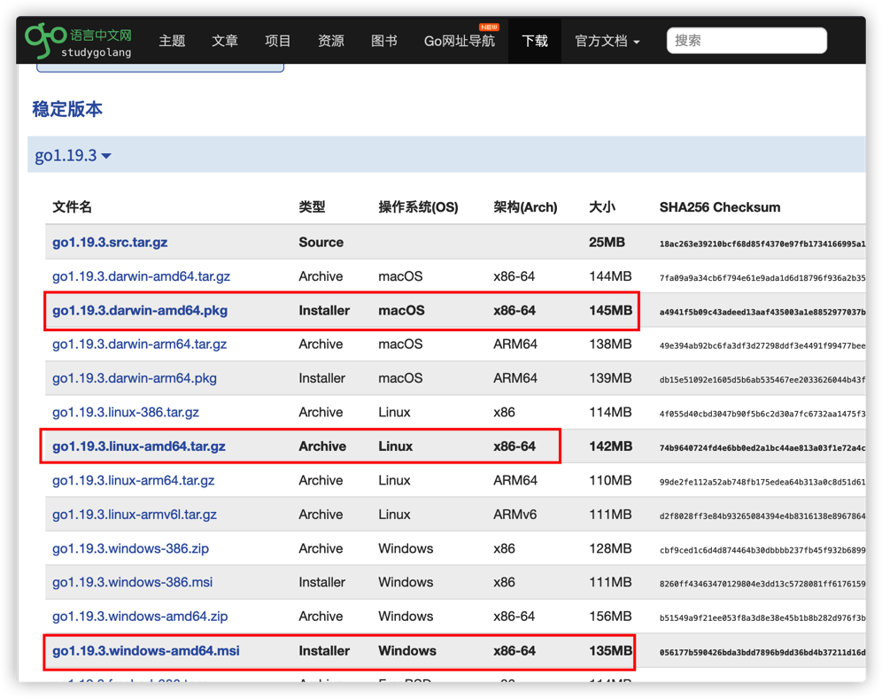

1、下载后直接安装

选择环境目录

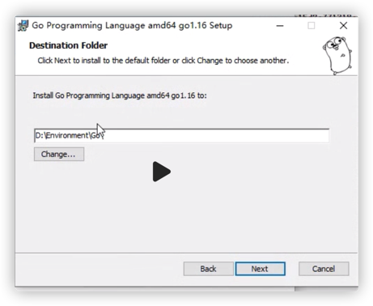


2、安装完成后，执行命令查看版本

```sh
go version
```

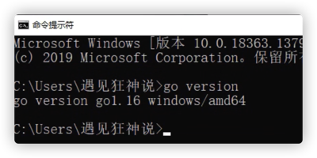


3、配置环境变量，go还需要一个工作目录，即GOROOT(go的安装目录) 和 GOPATH（存储go项目的工作目录）

我的电脑->属性->环境变量


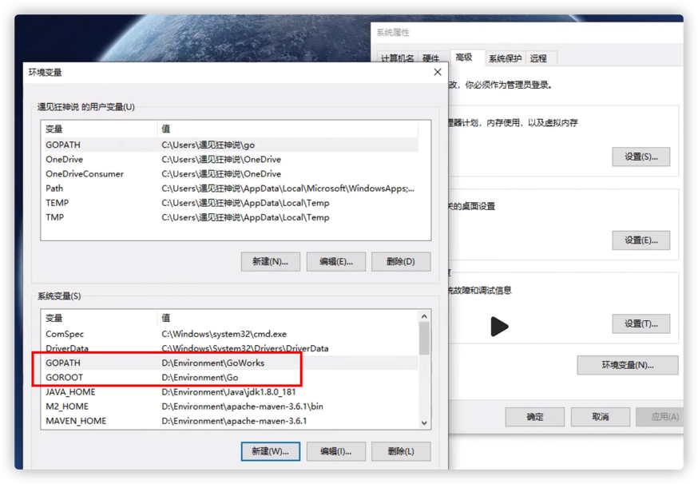

用户变量GOPATH要与系统变量GOPATH保持一致

4、GOPATH目录下需要新建src、bin、pkg三个目录


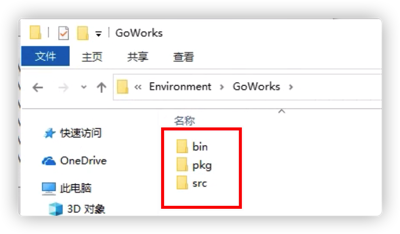

5、正常安装后，我们发现GO根目录下bin目录已经配置到系统化环境变量Path下了，就跟Java一样需要配置bin到Path，才可以在控制台识别go命令


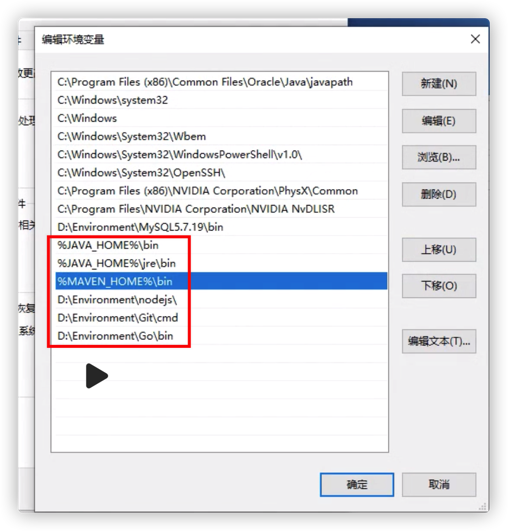

6、go env命令查看生效的变量


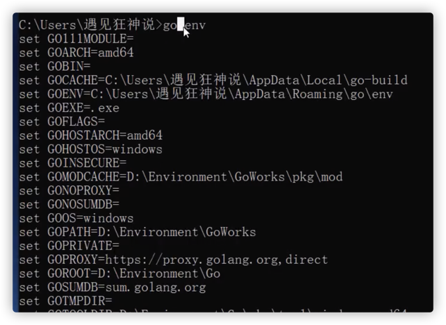

### Mac

一路傻瓜式安装后，安装包会默认安装在/usr/local目录下


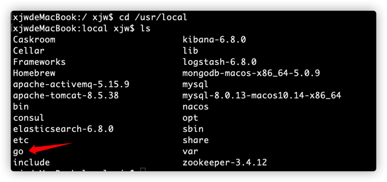

2、设置GOROOT环境变量

在终端运行

```sh
vi ～/.bash_profile
export GOROOT=/usr/local/go
按esc，输入:wq 保存退出编辑
```


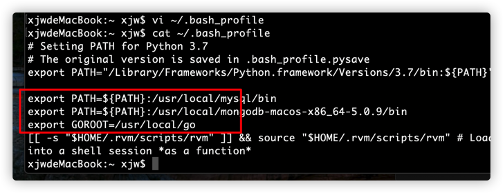

3、设置GOPATH环境变量

```sh
$HOME是每个电脑下的用户主目录，运行echo $HOME获取
```


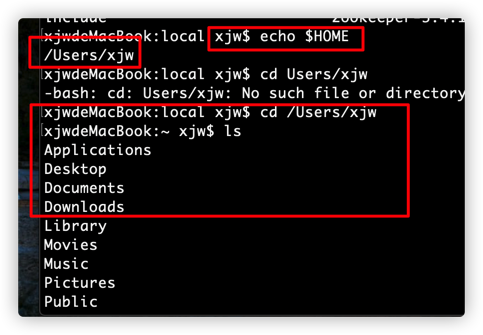

在`$HOME`目录下新建目录GoWorks，并新建新建src、bin、pkg三个子目录


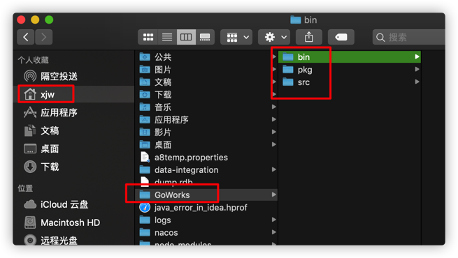

```sh
vi ～/.bash_profile
export GOROOT=/usr/local/go
export GOPATH=$HOME/GoWorks
按esc，输入:wq 保存退出编辑
```


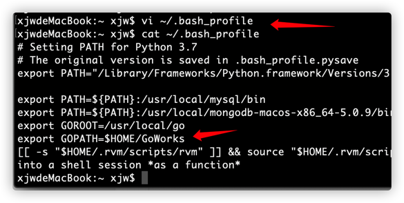

常用命令

```sh
go env # 查看环境变量
go get 地址 # 下载远程依赖
go list -m all # 查看项目使用的模块
go mod tidy # 清除未使用的依赖
```


## 4、开发工具GoLang安装

下载地址：[https://www.jetbrains.com/go/download/download-thanks.html](https://www.jetbrains.com/go/download/download-thanks.html)

### Windows

点击download下载，然后直接傻瓜式安装


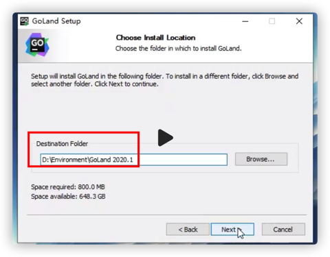

安装完后，启动goland


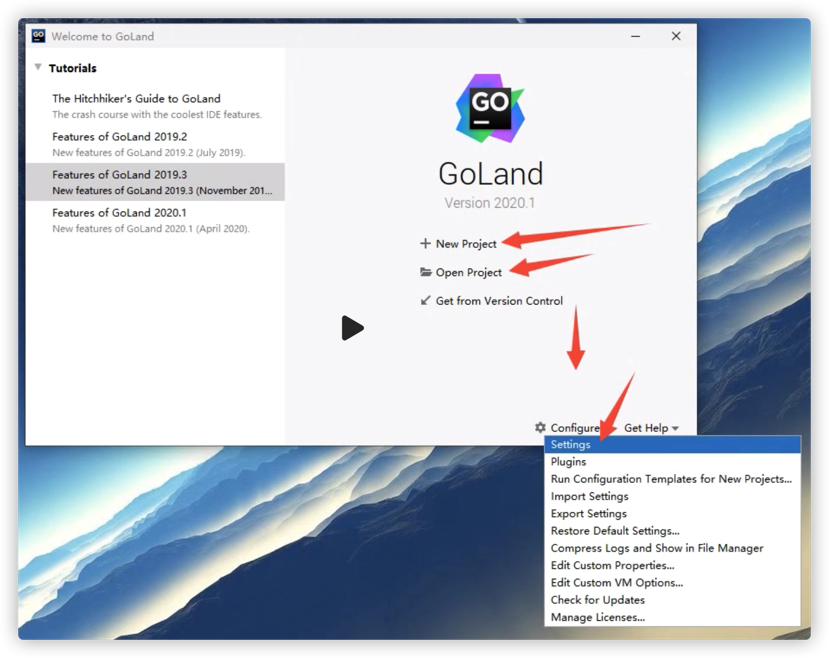

发现跟idea 很相似

1、new project


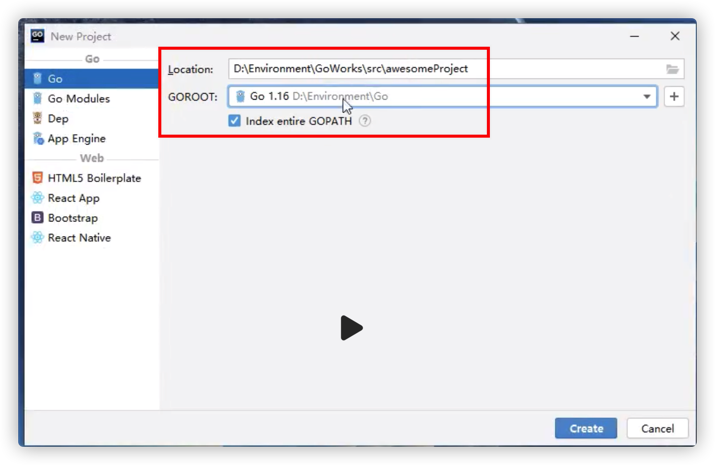

2、new file


### Mac

安装后需要激活，网站：http://blog.idejihuo.com/

## 5、Hello World

> Windows

1、创建hello.txt文件，把后缀改为go,

查看，勾选文件扩展名

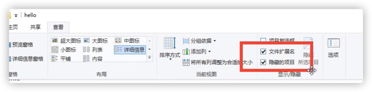


2、使用记事本编辑hello.go文件

```go
package main // 代表要打包成一个可执行的文件，一个程序里只能有一个main包
import "fmt"  // 导入一个系统包fmt用来输出

func main() {  // 程序入口
  fmt.Println("Hello world!")  // 打印hello world 字符串后换行
}

```

> 在Go语言里，命令为main的包具有特殊的含义，Go语言的编译程序会试图把这种名字的编译为二进制可执行文件，所有用Go语言编译的可执行程序都必须有一个名叫main的包，且仅有一个main包 。

编译器会在main包发现名为main()的函数，否则不会创建可执行文件，main()函数是程序的入口，没有这个函数程序就没有办法执行。

程序编译时，会声明main包的代码所在的目录的目录名作为二进制可执行文件的文件名。

在当前目录下，执行go run命令


3、在golang新建hello.go

调整文字大小,file->setting


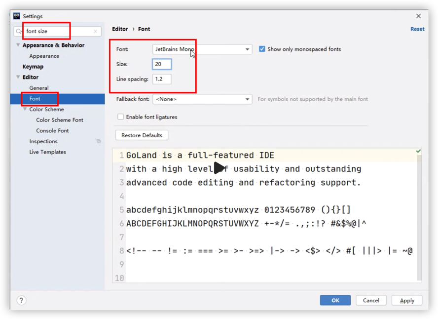

执行hello.go报错


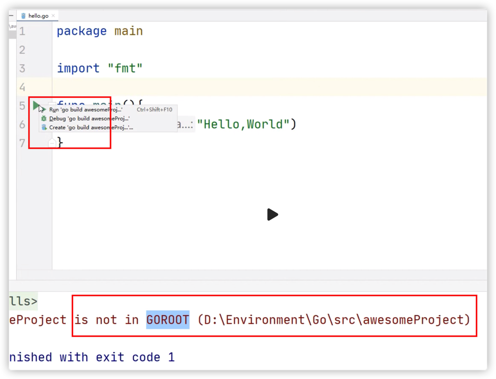

解决，设置go 环境变量GO111MODULE=off

```sh
go env -w GO111MODULE=off
```


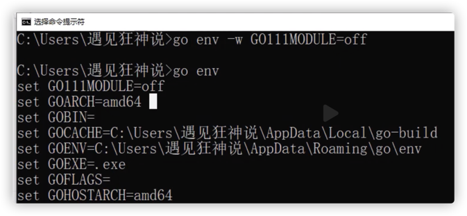

再次执行


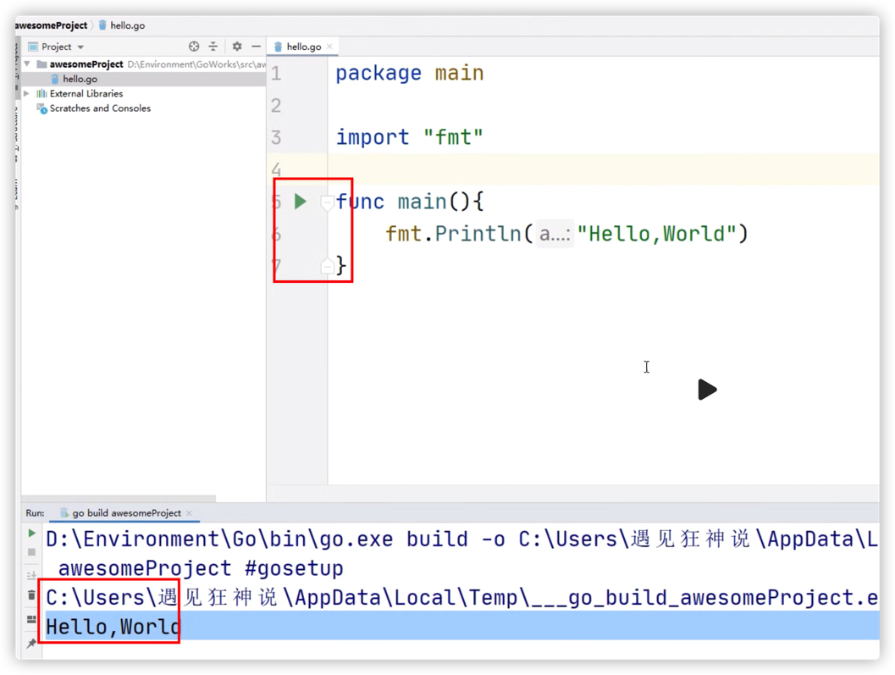
