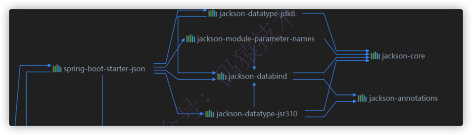

## 1、前言

Spring Boot默认内嵌了Tomcat，默认的端口号是8080 ，如果需要修改的话，只需要在配置文件中添加如下一行配置即可:

```properties
server.port=9090
```

自定义项目的上下文路径，在配置文件中添加：

```properties
server.servlet.context-path=/springboot01
```

以上的端口和项目路径改了之后，访问web接口就变为 http://localhost:9090/springboot01/user/1 

### JSON格式化

在前后端分离的项目中大部分的接口基本都是返回JSON字符串，因此对返回的JSON也是需要定制一下，比如`日期的格式，NULL值是否返回`等等内容。

Spring Boot默认是使用Jackson对返回结果进行处理，在引入WEB启动器的时候会引入相关的依赖，看maven依赖如下图：




引入了一个启动器，意味着我们既可以在配置文件中修改配置，也可以在配置类中重写其中的配置，JackSon的自动配置类是`JacksonAutoConfiguration`

- 在配置文件 application.properties 中设置指定格式，这属于**全局配置**，如下：

  ```properties
  spring.jackson.date-format= yyyy-MM-dd HH:mm:ss 
  spring.jackson.time-zone= GMT+8
  ```

- 在实体属性中标注 @JsonFormat 这个注解，属于局部配置，会覆盖全局配置，如下：

  ```java
  @JsonFormat(pattern = "yyyy-MM-dd HH:mm",timezone = "GMT+8") 
  private Date birthday;
  ```

配置完成之后返回的就是指定格式的日期，如下：

```json
{"id": "1", "age": 18, "birthday": "2020-09-30 17:21", "name": "不才陈某" }
```

自动配置类`JacksonAutoConfiguration ` 注入的ObjectMapper


自定义一个配置类，覆盖自动配置类`JacksonAutoConfiguration `注入的ObjectMapper 

```java
/*** 自定义jackson序列化与反序列规则，增加相关格式（全局配置） */ 
@Configuration 
public class JacksonConfig { 
  @Bean 
  @Primary 
  public ObjectMapper jacksonObjectMapper(Jackson2ObjectMapperBuilder builder) {
    builder.locale(Locale.CHINA); 
    builder.timeZone(TimeZone.getTimeZone(ZoneId.systemDefault()));
    builder.simpleDateFormat(DatePattern.NORM_DATETIME_PATTERN);
    builder.modules(new CustomTimeModule()); 
    ObjectMapper objectMapper = builder.createXmlMapper(false).build(); 
    objectMapper.setSerializationInclusion(JsonInclude.Include.NON_EMPTY);
    //遇到未知属性的时候抛出异常，
    //为true 会抛出异常 
    objectMapper.configure(DeserializationFeature.FAIL_ON_UNKNOWN_PROPERTIES, false);
    // 允许出现特殊字符和转义符 
    objectMapper.configure(JsonParser.Feature.ALLOW_UNQUOTED_CONTROL_CHARS, true);
    // 允许出现单引号 
    objectMapper.configure(JsonParser.Feature.ALLOW_SINGLE_QUOTES, true); 
    objectMapper.registerModule(new CustomTimeModule());
    return objectMapper; 
  } 
}
```

## 2、拦截器如何配置

基于Spring Boot 版本 2.3.4.RELEASE 

Spring MVC中的拦截器（ Interceptor ）类似于Servlet中的过滤器（ Filter ），它主要用于拦截用户请求并作相应的处理。例如通过拦截器可以进行权限验证、记录请求信息的日志、判断用户是否登录等。

自定义一个拦截器非常简单，只需要实现`HandlerInterceptor `这个接口即可，该接口有三个可以实现的方法，如下：

1. preHandle() 方法：该方法会在控制器方法前执行，其返回值表示是否知道如何写一个接口。中断后续操作。当其返回值为 true 时，表示继续向下执行；当其返回值为 false 时，会中断后续的所有操作（包括调用下一个拦截器和控制器类中的方法执行等）。

2. postHandle() 方法：该方法会在控制器方法调用之后，且解析视图之前执行。可以通过此方法对请求域中的模型和视图做出进一步的修改。

3. afterCompletion() 方法：该方法会在整个请求完成，即视图渲染结束之后执行。可以通过此方法实现一些资源清理、记录日志信息等工作。

实现`HandlerInterceptor `这个接口后，需要定义一个配置类，实现 WebMvcConfigurer 这个接口，并且实现其中的 addInterceptors() 方法即可，代码演示如下：

```java
@Configuration 
public class WebConfig implements WebMvcConfigurer { 
  @Autowired private XXX xxx;
  
  @Override 
  public void addInterceptors(InterceptorRegistry registry) { 
    //不拦截的uri 
    final String[] commonExclude = {}}; 
  registry.addInterceptor(xxx).excludePathPatterns(commonExclude); 
} 
}
```

> 重复请求处理

开发中可能会经常遇到短时间内由于用户的重复点击导致几秒之内重复的请求，可能就是在这几秒之内由于各种问题，比如 网络 ， 事务的隔离性 等等问题导致了数据的重复等问题，因此在日常开发中必须规避这类的重复请求操作，今天就用拦截器简单的处理一下这个问题。

**思路：**

在接口执行之前先对指定接口（比如标注某个 注解 的接口）进行判断，如果在指定的时间内（比如 5 秒 ）已经请求过一次了，则返回重复提交的信息给调用者。

根据项目的架构可能判断的条件也是不同的，比如 IP地址 ， 用户唯一标识 、 请求参数 、 请求URI 等等其中的某一个或者多个的组合

由于是 短时间 内甚至是瞬间并且要保证 定时失效 ，肯定不能存在事务性数据库中了，因此常用的几种数据库中只有 Redis 比较合适了

**实现：**

第1步，先自定义一个注解，可以标注在类或者方法上，如下：

```java
@Target({ElementType.METHOD, ElementType.TYPE}) 
@Retention(RetentionPolicy.RUNTIME) 
public @interface RepeatSubmit { 
  /*** 默认失效时间5秒 */ long seconds() default 5; 
}
```

第2步，创建一个拦截器，**注入到IOC容器中**，实现的思路很简单，判断controller的类或者方法上是否标注了 @RepeatSubmit 这个注解，如果标注了，则拦截判断，否则跳过，代码如下：

```java
/*** 重复请求的拦截器 
* @Component：该注解将其注入到IOC容器中 */ 
@Component 
public class RepeatSubmitInterceptor implements HandlerInterceptor { 
  /*** Redis的API */ 
  @Autowired private StringRedisTemplate stringRedisTemplate; 
  
  /*** preHandler方法，在controller方法之前执行 
  ** 判断条件仅仅是用了uri，实际开发中根据实际情况组合一个唯一识别的条件。
  */ 
  @Override public boolean preHandle(HttpServletRequest request, HttpServletResponse response, Object handler) throws Exception { 
    if (handler instanceof HandlerMethod){ 
      //只拦截标注了@RepeatSubmit该注解 
      HandlerMethod method=(HandlerMethod)handler; 
      //标注在方法上的@RepeatSubmit 
      RepeatSubmit repeatSubmitByMethod = AnnotationUtils.findAnnotation(method.getMethod(),RepeatSubmit.class); 
      //标注在controler类上的@RepeatSubmit 
      RepeatSubmit repeatSubmitByCls = AnnotationUtils.findAnnotation(method.getMethod().getDeclaringClass(), RepeatSubmit.class); 
      //没有限制重复提交，直接跳过
      if (Objects.isNull(repeatSubmitByMethod)&&Objects.isNull(repeatSubmitByCls)) return true; 
      
      // todo: 组合判断条件，这里仅仅是演示，实际项目中根据架构组合条件 
      //请求的URI 
      String uri = request.getRequestURI(); 
      //存在即返回false，不存在即返回true 
      Boolean ifAbsent = stringRedisTemplate.opsForValue().setIfAbsent(uri, "", Objects.nonNull(repeatSubmitByMethod)?repeatSubmitByMethod.seconds():repeatSubmitByCls.seconds(), TimeUnit.SECONDS);
      //如果存在，表示已经请求过了，直接抛出异常，由全局异常进行处理返回指定信息 
      if (ifAbsent!=null&&!ifAbsent) 
        throw new RepeatSubmitException(); 
    }
    return true;
  } 
}
```

第3步，拦截器生效

```java
@Configuration 
public class WebConfig implements WebMvcConfigurer { 
  @Autowired 
  private RepeatSubmitInterceptor repeatSubmitInterceptor; 
  
  @Override 
  public void addInterceptors(InterceptorRegistry registry) { 
    //不拦截的uri 
    final String[] commonExclude = {"/error", "/files/**"}; 
    registry.addInterceptor(repeatSubmitInterceptor).excludePathPatterns(commonExclude); 
  } 
}
```

OK，拦截器已经配置完成，只需要在需要拦截的接口上标注 @RepeatSubmit 这个注解即可，如下：

```java
@RestController 
@RequestMapping("/user") 
//标注了@RepeatSubmit注解，全部的接口都需要拦截 
@RepeatSubmit 
public class LoginController { 
  @RequestMapping("/login") 
  public String login(){ 
    return "login success"; 
  } 
}
```

此时，请求这个URI: http://localhost:8080/springboot-demo/user/login 在5秒之内只能请求一次。

**注意**：标注在方法上的超时时间会覆盖掉类上的时间，因为如下一段代码

```java
Boolean ifAbsent = stringRedisTemplate.opsForValue().setIfAbsent(uri, "", Objects.nonNull(repeatSubmitByMethod)?repeatSubmitByMethod.seconds():repeatSubmitByCls.seconds(), TimeUnit.SECONDS);
```

这段代码的失效时间先取值 repeatSubmitByMethod 中配置的，如果为null，则取值 repeatSubmitByCls 配置的。

## 3、过滤器如何配置

Filter 也称之为过滤器，它是Servlet技术中最实用的技术，WEB开发人员通过Filter技术，对web服务器管理的所有web资源：例如JSP，Servlet，静态图片文件或静态HTML文件进行拦截，从而实现一些特殊功能。例如实现 URL级别的权限控制 、 过滤敏感词汇 、 压缩响应信息 等一些高级功能。

### Filter执行原理

当客户端发出Web资源的请求时，Web服务器根据应用程序配置文件设置的过滤规则进行检查，若客户请求满足过滤规则，则对客户请求／响应进行拦截，对请求头和请求数据进行检查或改动，并依次通过过滤器链，最后把请求／响应交给请求的Web资源处理。请求信息在过滤器链中可以被修改，也可以根据条件让请求不发往资源处理器，并直接向客户机发回一个响应。当资源处理器完成了对资源的处理

后，响应信息将逐级逆向返回。同样在这个过程中，用户可以修改响应信息，从而完成一定的任务，如下图：


服务器会按照过滤器定义的先后循序组装成 一条链 ，然后一次执行其中的 doFilter() 方法。（注：这一点 Filter 和 Servlet 是不一样的）执行的顺序就如下图所示，执行第一个过滤器的 chain.doFilter() 之前的代码，第二个过滤器的 chain.doFilter() 之前的代码，请求的资源，第二个过滤器的chain.doFilter() 之后的代码，第一个过滤器的 chain.doFilter() 之后的代码，最后返回响应。


请求在经过拦截器、过滤器的流程如下图：


### 自定义Filter

这个问题其实不是Spring Boot这个章节应该介绍的了，在Spring MVC中就应该会的内容，只需要实现 javax.servlet.Filter 这个接口，重写其中的方法。实例如下：

```java
@Component 
public class CrosFilter implements Filter { 
  //重写其中的doFilter方法 
  @Override public void doFilter(ServletRequest req, ServletResponse res, FilterChain chain) throws IOException, ServletException {
    //继续执行下一个过滤器 
    chain.doFilter(req, response);
  }
```

自定义好了过滤器当然要使其在Spring Boot中生效了，Spring Boot配置Filter有两种方式

1. **配置类中使用@Bean注入【推荐使用】**

   只需要将 FilterRegistrationBean 这个实例注入到IOC容器中即可，如下

   ```java
   @Configuration 
   public class FilterConfig { 
     @Autowired
     private Filter1 filter1; 
     
     @Autowired 
     private Filter2 filter2; 
     
     /*** 注入Filter1 * @return */ 
     @Bean 
     public FilterRegistrationBean filter1() { 
       FilterRegistrationBean registration = new FilterRegistrationBean(); 
       registration.setFilter(filter1); 
       registration.addUrlPatterns("/*"); 
       registration.setName("filter1");
       //设置优先级别
       registration.setOrder(1); 
       return registration; 
     }
     
     /*** 注入Filter2 * @return */ 
     @Bean 
     public FilterRegistrationBean filter2() { 
       FilterRegistrationBean registration = new FilterRegistrationBean(); 
       registration.setFilter(filter2); 
       registration.addUrlPatterns("/*"); 
       registration.setName("filter2"); 
       //设置优先级别 
       registration.setOrder(2); 
       return registration; 
     } 
   }
   ```

   **注意：设置的优先级别决定了过滤器的执行顺序。**

2. **使用@WebFilter**

   @WebFilter 是Servlet3.0的一个注解，用于标注一个Filter，Spring Boot也是支持这种方式，只需要在自定义的Filter上标注该注解即可，如下：

   ```java
   @WebFilter(filterName = "crosFilter",urlPatterns = {"/*"}) 
   public class CrosFilter implements Filter { 
     //重写其中的doFilter方法 
     @Override public void doFilter(ServletRequest req, ServletResponse res, FilterChain chain) throws IOException, ServletException { 
       //继续执行下一个过滤器 
       chain.doFilter(req, response); 
     }
   }
   ```

**要想** @WebFilter **注解生效，需要在配置类上标注另外一个注解** @ServletComponentScan **用于扫描使其生效**，如下：

```java
@SpringBootApplication
@ServletComponentScan(value = {"com.example.springbootintercept.filter"})
public class SpringbootApplication {
  
}
```

至此，配置就完成了，启动项目，即可正常运行。

### 跨域举例

主要介绍如何使用过滤器来解决跨域问题，只需要在请求头中添加相应支持跨域的内容即可， 如下代码仅仅是简单的演示下，针对细致的内容还需自己完善，比如白名单等等。

```java
@Component 
public class CrosFilter implements Filter { 
  //重写其中的doFilter方法 
  @Override 
  public void doFilter(ServletRequest req, ServletResponse res, FilterChain chain) throws IOException, ServletException { 
    HttpServletResponse response = (HttpServletResponse) res; 
    response.setHeader("Access-Control-Allow-Origin", "*"); 
    response.setHeader("Access-Control-Allow-Credentials", "true"); 
    response.setHeader("Access-Control-Allow-Methods", "POST, GET, OPTIONS, DELETE"); 
    response.setHeader("Access-Control-Max-Age", "3600");
    response.setHeader("Access-Control-Allow-Headers"," Origin, X-Requested-With, Content-Type, Accept"); 
    //继续执行下一个过滤器 
    chain.doFilter(req, response); 
  } 
}
```

配置类中注入 FilterRegistrationBean ，如下代码：

```java
@Configuration
public class FilterConfig { 
  @Autowired 
  private CrosFilter crosFilter; 
  
  /*** 注入crosFilter * @return */ 
  @Bean
  public FilterRegistrationBean crosFilter() { 
    FilterRegistrationBean registration = new FilterRegistrationBean(); 
    registration.setFilter(crosFilter); 
    registration.addUrlPatterns("/*");
    registration.setName("crosFilter"); 
    //设置优先级别
    registration.setOrder(Ordered.HIGHEST_PRECEDENCE);
    return registration; 
  } 
}
```

至此，配置完成，相关细致功能还需自己润色。

过滤器内容相对简单些，但是在实际开发中不可或缺，比如常用的权限控制框架 Shiro ， Spring Security ，源码都使用了过滤器

- [SpringMVC拦截器Interceptor和过滤器filter的使用](/spring/2020/01/07/springmvc-interceptor-filter.html)

- [SpringSecurity 过滤器链](/icoding-edu/2020/03/25/icoding-note-013.html)

- [SpringBoot 解决跨域问题的3种方法](/springboot/2021/01/27/spring-boot-cors.html)

## 4、过滤gzip请求解压数据

Controller层请求接口

```java
@RestController
@RequestMapping("/v1/log")
public class LogbackController implements LogbackApi {
    @Resource
    LogbackService logbackService;

    /**
     * 发送日志到kafka
     * @param list
     */
    @Override
    @PostMapping("")
    public void saveBatch(@RequestBody @Valid List<LogAppendDTO> list) {
        logbackService.saveBatch(list);
    }
}
```

上传的是json数组

业务层实现类

```java
@Slf4j
@Service
public class LogbackServiceImpl implements LogbackService {
    @Value("${spring.profiles.active}")
    String profile;

    @Resource
    KafkaTemplate<String,Object> kafkaTemplate;

    @Override
    public void saveBatch(List<LogAppendDTO> logAppends) {
        if(CollectionUtils.isEmpty(logAppends)){
            return;
        }

        SimpleDateFormat dateFormat=new SimpleDateFormat("yyyy-MM-dd HH:mm:ss");
        String suffix = MessageFormat.format("-{0}-client-log",profile);

        logAppends.stream().filter(logAppend-> StringUtils.isNotBlank(logAppend.getSystemCode())).forEach(logAppend->{
            LogMsgDTO logMsg=new LogMsgDTO();
            BeanCopyUtil.copy(logAppend,logMsg);

            //ELK中时间必须为字符型
            logMsg.setTime(dateFormat.format(logAppend.getTime()));
            //ELK中使用serviceName作为索引名称的一部份,因此必须具备该字段值
            logMsg.setServiceName(logAppend.getAppId());

            String topic = MessageFormat.format("{0}{1}",logMsg.getSystemCode(),suffix);
            ListenableFuture<SendResult<String, Object>> future = kafkaTemplate.send(topic, logMsg);
            // ack回调
            future.addCallback(new ListenableFutureCallback<SendResult<String, Object>>() {
                @Override
                public void onFailure(Throwable throwable) {
                    String msg=MessageFormat.format("日志发送kafka失败，topic:{},appId:{},modelId:{},deviceId:{}",topic,logMsg.getAppId(),logMsg.getModelId(),logMsg.getDeviceId());
                    log.error(msg,throwable);
                }

                @Override
                public void onSuccess(SendResult<String, Object> sendResult) {
                    log.debug("日志发送kafka成功，topic:{},appId:{},modelId:{},deviceId:{}",topic,logMsg.getAppId(),logMsg.getModelId(),logMsg.getDeviceId());
                }
            });
        });
    }
}
```

日志数据发送到kafka，日志数据量大，为了减少网络传输的耗时，前端会将数据gzip压缩为字节流后再传输给后端，经过nginx，如果nginx配置了自动解压，那么数据解压后才会流向后端服务，gzip请求对后端来说是无感的，否则压缩后数据流向后端服务，后端服务需要解压数据才能正常使用，为了不入侵原有代码，可以使用过滤器Filter将压缩数据解压后再将请求dispatch发送到Controlle层的接口方法

1、新增解压请求的包装类`UnZipRequestWrapper`继承`HttpServletRequestWrapper`，对请求体进行解压写回body

```java
@Slf4j
public class UnZipRequestWrapper extends HttpServletRequestWrapper {
    private final byte[] bytes;

    public UnZipRequestWrapper(HttpServletRequest request) throws IOException {
        super(request);
        try (BufferedInputStream bis = new BufferedInputStream(request.getInputStream());
            ByteArrayOutputStream baos = new ByteArrayOutputStream()) {
            final byte[] body;
            byte[] buffer = new byte[1024];
            int len;
            // 读取IO输入流到字节数组，字节数组写入IO输出流
            while ((len = bis.read(buffer)) > 0) {
                baos.write(buffer, 0, len);
            }
            body = baos.toByteArray();
            if (body.length == 0) {
                log.info("Body无内容，无需解压");
                bytes = body;
                return;
            }
            // this.bytes = GZIPUtils.uncompressToByteArray(body); // 自定义的压缩工具类
           // hutool的压缩工具类, 解压字节数组
           this.bytes = ZipUtil.unGzip(body); 
        } catch (IOException ex) {
            log.info("解压缩步骤发生异常！");
            ex.printStackTrace();
            throw ex;
        }
    }

    @Override
    public ServletInputStream getInputStream() throws IOException {
        final ByteArrayInputStream byteArrayInputStream = new ByteArrayInputStream(bytes);
        return new ServletInputStream() {
            @Override
            public boolean isFinished() {
                return false;
            }

            @Override
            public boolean isReady() {
                return false;
            }

            @Override
            public void setReadListener(ReadListener readListener) {

            }

            public int read() throws IOException {
                return byteArrayInputStream.read();
            }
        };
    }

    @Override
    public BufferedReader getReader() throws IOException {
        return new BufferedReader(new InputStreamReader(this.getInputStream()));
    }
}
```

自定义的压缩工具类

```java
public class GZIPUtils {
    public static final String GZIP_ENCODE_UTF_8 = "UTF-8";

    /**
     * 字符串压缩为GZIP字节数组
     * @param str
     * @return
     */
    public static byte[] compress(String str) {
        return compress(str, GZIP_ENCODE_UTF_8);
    }
 
    /**
     * 字符串压缩为GZIP字节数组
     * @param str
     * @param encoding
     * @return
     */
    public static byte[] compress(String str, String encoding) {
        if (str == null || str.length() == 0) {
            return null;
        }
        ByteArrayOutputStream out = new ByteArrayOutputStream();
        GZIPOutputStream gzip;
        try {
            gzip = new GZIPOutputStream(out);
            gzip.write(str.getBytes(encoding));
            gzip.close();
        } catch (IOException e) {
            e.printStackTrace();
        }
        return out.toByteArray();
    }
 
    /**
     * GZIP解压缩
     * @param bytes
     * @return
     */
    public static byte[] uncompress(byte[] bytes) {
        if (bytes == null || bytes.length == 0) {
            return null;
        }
        ByteArrayOutputStream out = new ByteArrayOutputStream();
        ByteArrayInputStream in = new ByteArrayInputStream(bytes);
        try {
            GZIPInputStream ungzip = new GZIPInputStream(in);
            byte[] buffer = new byte[256];
            int n;
            while ((n = ungzip.read(buffer)) >= 0) {
                out.write(buffer, 0, n);
            }
        } catch (IOException e) {
            e.printStackTrace();
        }
        return out.toByteArray();
    }
 
    /**
     * 解压并返回String
     * @param bytes
     * @return
     */
    public static String uncompressToString(byte[] bytes) throws IOException {
        return uncompressToString(bytes, GZIP_ENCODE_UTF_8);
    }

    /**
     *
     * @param bytes
     * @return
     */
    public static byte[] uncompressToByteArray(byte[] bytes) throws IOException {
        return uncompressToByteArray(bytes, GZIP_ENCODE_UTF_8);
    }
 
    /**
     * 解压成字符串
     * @param bytes 压缩后的字节数组
     * @param encoding 编码方式
     * @return 解压后的字符串
     */
    public static String uncompressToString(byte[] bytes, String encoding) throws IOException {
        byte[] result = uncompressToByteArray(bytes, encoding);
        return new String(result);
    }

    /**
     * 解压成字节数组
     * @param bytes
     * @param encoding
     * @return
     */
    public static byte[] uncompressToByteArray(byte[] bytes, String encoding) throws IOException {
        if (bytes == null || bytes.length == 0) {
            return null;
        }
        ByteArrayOutputStream out = new ByteArrayOutputStream();
        ByteArrayInputStream in = new ByteArrayInputStream(bytes);
        try {
            GZIPInputStream ungzip = new GZIPInputStream(in);
            byte[] buffer = new byte[256];
            int n;
            while ((n = ungzip.read(buffer)) >= 0) {
                out.write(buffer, 0, n);
            }
            return out.toByteArray();
        } catch (IOException e) {
            e.printStackTrace();
            throw new IOException("解压缩失败！");
        }
    }

    /**
     * 将字节流转换成文件
     * @param filename
     * @param data
     * @throws Exception
     */
    public static void saveFile(String filename,byte [] data)throws Exception{
        if(data != null){
            String filepath ="/Users/algorix/Downloads/" + filename;
            File file  = new File(filepath);
            if(file.exists()){
                file.delete();
            }
            FileOutputStream fos = new FileOutputStream(file);
            fos.write(data,0,data.length);
            fos.flush();
            fos.close();
            System.out.println(file);
        }
    }
```

2、自定义过滤器GzipFilter

```java
@Slf4j
@Component
public class GzipFilter implements Filter {
    private static final String CONTENT_ENCODING = "Content-Encoding";
    private static final String CONTENT_ENCODING_TYPE = "gzip";

    @Override
    public void doFilter(ServletRequest request, ServletResponse response, FilterChain chain) throws IOException, ServletException {
        long start = System.currentTimeMillis();
        HttpServletRequest httpServletRequest = (HttpServletRequest)request;
        String encodeType = httpServletRequest.getHeader(CONTENT_ENCODING);
        if (CONTENT_ENCODING_TYPE.equals(encodeType)) {
            log.info("请求:{} 需要解压", httpServletRequest.getRequestURI());
            // 对request请求进行解压包装
            UnZipRequestWrapper unZIPRequestWrapper = new UnZipRequestWrapper(httpServletRequest);
            chain.doFilter(unZIPRequestWrapper,response);
        } else {
            log.info("请求:{} 无需解压", httpServletRequest.getRequestURI());
            chain.doFilter(request,response);
        }
        log.info("耗时：{}ms", System.currentTimeMillis() - start);
    }
}
```

3、注册过滤器

```java
@Configuration
public class FilterConfig {
    @Resource
    private GzipFilter gzipFilter;

    @Bean
    public FilterRegistrationBean filterGzip(){
        FilterRegistrationBean registration = new FilterRegistrationBean<>();
        //Filter可以new，也可以使用依赖注入Bean
        registration.setFilter(gzipFilter);
        //过滤器名称
        registration.setName("gzipFilter");
        //拦截路径
        registration.addUrlPatterns("/v1/log/*");
        //设置顺序
        registration.setOrder(1);
        return registration;
    }
}
```

完成，可以测试

## 5、过滤器修改响应数据

第一步，自定义注解@CsDict

```java
@Target(ElementType.FIELD)
@Retention(RetentionPolicy.RUNTIME)
@Documented
public @interface CsDict {

    /**
     * 字典编码
     */
    String code() default "";
}
```

第二步，返回的DTO类字段增加该注解标记

```java
@Data
@ApiModel("Bip用户信息")
public class PersonInformationDTO implements Serializable {
	private static final long serialVersionUID = 1L;

	@ApiModelProperty(value = "bip账号")
	private String bip;

	@ApiModelProperty(value = "姓名")
	private String name;

	@CsDict(code = "GenderTypeEnum")
	@ApiModelProperty(value = "性别，M:男，F:女")
	private GenderTypeEnum gender;

	@ApiModelProperty(value = "民族")
	@CsDict(code = "PartyMemberEthnicity")
	private String nation;

	@ApiModelProperty(value = "籍贯")
	private String nativePlace;

	@ApiModelProperty(value = "学历")
	@CsDict(code = "EducationType")
	private String education;
}
```

第三步，pom.xml增加maven依赖

```xml
<dependency>
    <groupId>com.alibaba</groupId>
    <artifactId>fastjson</artifactId>
    <version>1.2.60</version>
</dependency>
```

自定义过滤器EnumAfterFilter 继承AfterFilter，AfterFilter实现了序列化过滤器SerializeFilter 接口，该接口有个`writeAfter`方法，对响应的DTO进行序列化处理


```java
public class EnumAfterFilter extends AfterFilter {
    
    /**
     * 字典查询接口
     */
    private DictMapQuery dictMapQuery;

    public EnumAfterFilter(DictMapQuery dictMapQuery) {
        this.dictMapQuery = dictMapQuery;
    }

    @Override
    public void writeAfter(Object object) {
        if (object == null) {
            return;
        }
        // 反射获取响应DTO的所有属性字段
        Field[] fields = ReflectUtil.getFields(object.getClass());
        // 没有包含@CsDict注解的字段，方法执行结束，否则往下执行
        if (!hasCsDict(fields)) {
            return;
        }
        Map<String, Map<String, String>> fieldValueMap;
        // 判断是否能从线程变量获取DTO的注解字段与字典的映射Map集合，Map集合要包含DTO的所有@CsDict注解字段
        if (checkIfCanGetFromLocal(fields)) {
            // 获取线程变量，字段与字典配置的Map集合
            fieldValueMap = ThreadLocalHolder.queryFromDictMapHolder();
        } else {
            // 创建字段与字典配置的Map集合
            fieldValueMap = generateFieldValueMap(fields);
            // 线程变量set值
            pushToThreadLocal(fieldValueMap);
        }
        // 循环DTO字段
        for (Field field : fields) {
            if (CsEnum.class.isAssignableFrom(field.getType())) {
                // 枚举类，通过反射获取字段的枚举值
            	CsEnum<?> enumValue = (CsEnum<?>) ReflectUtil.getFieldValue(object, field);
                if (enumValue != null) {
                    writeKeyValue(field.getName() + "Description", enumValue.getDescription());
                    writeKeyValue(field.getName(), enumValue.getValue().toString());
                }
            }else {
                // 读取字典配置
	            Map<String, String> valueMap = fieldValueMap.get(field.getName());
	            if (valueMap != null && !valueMap.isEmpty()) {
	                Object fieldValue = ReflectUtil.getFieldValue(object, field);
	                if(fieldValue != null){
	                    String value = valueMap.get(fieldValue.toString());
	                    if (value != null) {
	                        writeKeyValue(field.getName(), fieldValue);
	                        writeKeyValue(field.getName() + "Description", value);
	                    }
	                }
	            }
            }
        }
    }
    
    /**
     * 判断是否能直接从线程变量获取DTO的字段与字典映射Map集合
     * @param fields DTO的字段数组
     * @return
     */
    private boolean checkIfCanGetFromLocal(Field[] fields) {
        // 获取字典Map集合的线程变量
        Map<String, Map<String, String>> fieldValueMap = ThreadLocalHolder.queryFromDictMapHolder();
        if (fieldValueMap == null || fieldValueMap.isEmpty()) {
            return false;
        }

        // 带有@CsDict注解的Field字段名称Set集合
        Set<String> currentFieldNameWithCsDict = Stream.of(fields)
                // [字段名称:字典编码]的键值对
                .map(generatePair())
                .filter(Objects::nonNull)
                .map(Pair::getKey)
                .collect(Collectors.toSet());

        // 线程变量fieldValueMap是否包含返回DTO的全部@CsDict注解字段
        return fieldValueMap.keySet().containsAll(currentFieldNameWithCsDict);
    }
    
    /**
     * 创建DTO字段与字典配置的映射Map集合
     * @param fields DTO的字段数组
     * @return
     */
    private Map<String, Map<String, String>> generateFieldValueMap(Field[] fields) {
        if (dictMapQuery == null) {
            return Collections.emptyMap();
        }
        // Map集合[field: dictCode]
        Map<String, String> fieldCodeMap = Stream.of(fields)
                // [字段名称:字典编码]的键值对
                .map(generatePair())
                .filter(Objects::nonNull)
                .collect(Collectors.toMap(Pair::getKey, this::generateValue, (oldOne, newOne) -> newOne));
        // 字典编码Set集合
        Set<String> codeSet = new HashSet<>(fieldCodeMap.values());
        // 根据字典编码查询字典的子集，返回Map集合，key是dictCode, value是Map[dictKey:dictValue]
        Map<String, Map<String, String>> queryResultMap = dictMapQuery.query(codeSet);

        return fieldCodeMap.entrySet()
                .stream()
                .map(entry -> {
                    // dictCode的字典配置
                    Map<String, String> value = queryResultMap.get(entry.getValue());
                    if (value == null) {
                        value = new HashMap<>();
                    }
                    // 字段映射字典配置的键值对
                    return new Pair<>(entry.getKey(), value);
                }).collect(Collectors.toMap(Pair::getKey, Pair::getValue));
    }
    
    /**
     * 返回字典编码，后缀-
     * @param pair [字段名称:字典编码]的键值对
     * @return
     */
    private String generateValue(Pair<String, String> pair) {
        String code = pair.getValue();
        if (code.endsWith("-")) {
            return code;
        }
        return code + "-";
    }
    
    /**
     * 判断是否包含CsDict注解
     * @param fields
     * @return
     */
    private Boolean hasCsDict(Field[] fields) {
        boolean flag = false;
        for (Field field : fields) {
            CsDict annotation = field.getAnnotation(CsDict.class);
            if(Objects.nonNull(annotation) && !StrUtil.isEmpty(annotation.code())){
                flag = true;
                break;
            }
        }
        return flag;
    }
    
    /**
     * 返回一个函数式接口，该函数式接口传入一个Field参数，返回[字段名称:字典编码]的键值对
     * @return
     */
    private Function<Field, Pair<String, String>> generatePair() {
        return field -> {
            CsDict annotation = field.getAnnotation(CsDict.class);
            if (annotation == null) {
                return null;
            }
            String code = annotation.code();
            // 字典编码不能为空
            if (StrUtil.isEmpty(code)) {
                return null;
            }
            // 返回[字段名称:字典编码]的键值对
            return new Pair<>(field.getName(), code);
        };
    }
    
    private void pushToThreadLocal(Map<String, Map<String, String>> fieldValueMap) {
        if (fieldValueMap.isEmpty()) {
            return;
        }
        Map<String, Map<String, String>> existDictMap = ThreadLocalHolder.queryFromDictMapHolder();
        if (existDictMap == null || existDictMap.isEmpty()) {
            ThreadLocalHolder.pushToDictMapHolder(fieldValueMap);
            return;
        }
        Map<String, Map<String, String>> tempMap = new HashMap<>();
        existDictMap.forEach(tempMap::putIfAbsent);
        fieldValueMap.forEach(tempMap::putIfAbsent);
        ThreadLocalHolder.cleanDictMapHolder();
        ThreadLocalHolder.pushToDictMapHolder(tempMap);
    }
}   
```

第四步，自定义配置类`CsWebConfiguration`实现接口`WebMvcConfigurer`，重写 `configureMessageConverters`方法


```java
public class CsWebConfiguration implements WebMvcConfigurer {
	private DictMapQuery dictMapQuery;
	private SerializeFilter[] serializeFilters;

	public CsWebConfiguration(DictMapQuery dictMapQuery, SerializeFilter... serializeFilters) {
		this.dictMapQuery = dictMapQuery;
		this.serializeFilters = serializeFilters;
	}

	/**
	 * 注册Http消息转换器，当读写request请求体或response响应体会使用已注册的过滤器对body进行过滤
	 */
	@Override
	public void configureMessageConverters(List<HttpMessageConverter<?>> converters) {
		// json转换器
		FastJsonHttpMessageConverter converter = new FastJsonHttpMessageConverter();
		converter.setSupportedMediaTypes(SupportedMediaTypes.TYPES);
		
		FastJsonConfig config = new FastJsonConfig();
		config.setSerializerFeatures(SerializerFeature.DisableCircularReferenceDetect, SerializerFeature.WriteEnumUsingToString, SerializerFeature.WriteDateUseDateFormat, SerializerFeature.WriteMapNullValue);
		List<SerializeFilter> serializeFilterList = new ArrayList<>();
		serializeFilterList.add(new MaxLongValueFilter());
		if (dictMapQuery != null) {
			serializeFilterList.add(new EnumAfterFilter(dictMapQuery));
		}
		if (serializeFilters != null) {
			serializeFilterList.addAll(Arrays.asList(serializeFilters));
		}
//		serializeFilterList.add(new MaxLongValueFilter());
		config.setSerializeFilters(serializeFilterList.toArray(new SerializeFilter[0]));
		converter.setFastJsonConfig(config);
		config.setParserConfig(new ParserConfig() {
			@Override
			public ObjectDeserializer getDeserializer(Class<?> clazz, Type type) {
				if (clazz.isEnum()) {
					Class<?> deserClass = null;
					JSONType jsonType = clazz.getAnnotation(JSONType.class);
					if (jsonType != null) {
						deserClass = jsonType.deserializer();
						try {
							ObjectDeserializer derializer = (ObjectDeserializer) deserClass.newInstance();
							this.putDeserializer(type, derializer);
							return derializer;
						} catch (Throwable error) {
							// skip
						}
					}
					// 这里替换了原来的反序列化器。
					return new EnumValueDeserializer();
				}
				return super.getDeserializer(clazz, type);
			}
		});
		converters.add(0, new StringHttpMessageConverter(StandardCharsets.UTF_8));
//		converters.add(0, new MappingJackson2HttpMessageConverter());
		converters.add(1, converter);
	}

	@Override
	public void addInterceptors(InterceptorRegistry registry) {
		registry.addInterceptor(new HttpResponseContentTypeInterceptor()).addPathPatterns("/**");
	}

	@Override
	public void addFormatters(FormatterRegistry registry) {
		registry.addConverterFactory(new CsEnumConverterFactory());
	}

	public static class CsEnumConverterFactory implements ConverterFactory<Serializable, CsEnum<Serializable>> {
		private static final Map<Class<?>, Converter<?, ?>> CONVERTERS = new HashMap<>();

		@SuppressWarnings("unchecked")
		@Override
		public <T extends CsEnum<Serializable>> Converter<Serializable, T> getConverter(Class<T> targetType) {
			Converter<Serializable, T> converter = (Converter<Serializable, T>) CONVERTERS.get(targetType);
			if (converter == null) {
				converter = new ObjectToEnumConverter<T>(targetType);
				CONVERTERS.put(targetType, converter);
			}
			return converter;
		}
	}

	@Slf4j
	static final class ObjectToEnumConverter<E extends CsEnum<Serializable>> implements Converter<Serializable, E> {
		private Class<E> enumType;

		ObjectToEnumConverter(Class<E> enumType) {
			this.enumType = enumType;
		}

		@Override
		public E convert(Serializable source) {
			return Optional.ofNullable(ConstantEnumUtils.getEnumByAttribute(enumType, source, (ele) -> ele.getValue())).map(value -> {
				log.debug("【类型转换】获取枚举字段【{}】【枚举值】：{}", enumType, source);
				return value;
			}).orElseGet(() -> {
				log.debug("【类型转换】获取枚举字段【{}】【枚举名称】：{}", enumType, source);
				return null;
			});
		}
	}
}
```

最终返回的DTO对象会增加xxxDescription字段，会读取原字段的枚举值或者系统字典配置的描述值，如下面的`genderDescription`、`educationDescription`


系统字典配置通常可在页面进行配置：


