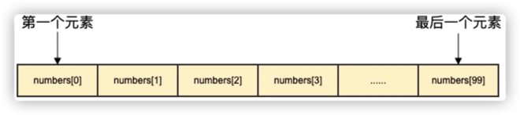
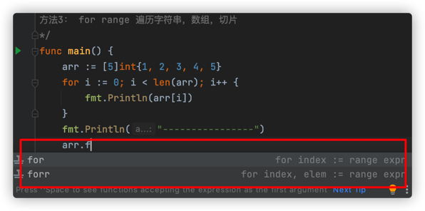

## 1、初识数组

**数组大小定义后，是不可以改变的**，数组的元素是相同类型，不允许出现混合类型




下标从0开始

语法格式：

```go
var 变量名 [大小]变量类型
```

```go
func main() {
	// 声明一个数组,需要指定容量
	var nums [4]int

	// 数组的下标从0开始
	nums[0] = 1
	nums[1] = 2
	nums[2] = 3

	// 打印数组的数据类型
	fmt.Printf("%T\n", nums)
	// 我们是通过下标来获取数组元素的
	fmt.Println(nums[0])
	fmt.Println(nums[1])

	// 数组的常用方法
	fmt.Println(len(nums)) // 长度
	fmt.Println(cap(nums)) // 容量 与长度一样

	// 修改数组的值
	fmt.Println(nums)
	nums[0] = 100
	fmt.Println(nums)
}
```

执行结果：

```go
[4]int
1
2
4
4
[1 2 3 0]
[100 2 3 0]
```

## 2、数组的初始化

```go
func main() {
	// 常规的初始
	var arr1 = [5]int{1, 2, 3, 4, 5}
	fmt.Println(arr1)
	// 快速的初始
	arr2 := [5]int{6, 7, 8, 9, 10}
	fmt.Println(arr2)

	// ... 不确定数组多大
	// 编译器会根据数据元素个数推断数组的长度
	arr3 := [...]string{"kuangshen", "feige", "hello"}
	fmt.Println(len(arr3))
	fmt.Println(cap(arr3))

	// 通过指定下标初始化,没有赋值的元素，int默认0,string默认空字符串
	arr4 := [5]int{1: 4, 4: 100}
	fmt.Println(arr4)
}
```

执行结果：

```sh
[1 2 3 4 5]
[6 7 8 9 10]
3
3
[0 4 0 0 100]
```

## 3、遍历数组

```go
/*
数组的遍历
方法1： arr[0],arr[1]....
方法2：通过循环，配合下标

	 for i := 0; i < len(arr); i++ {
			arr[i]
		}

方法3： for range 遍历字符串，数组，切片
*/
func main() {
	arr := [5]int{1, 2, 3, 4, 5}
	for i := 0; i < len(arr); i++ {
		fmt.Println(arr[i])
	}
	fmt.Println("----------------")
	for i, i2 := range arr {
		fmt.Println(i, i2) // 打印下标与元素值
	}
}
```

执行结果：

```sh
1
2
3
4
5
----------------
0 1
1 2
2 3
3 4
4 5
```

快捷键




## 4、数组是值类型传递

值类型传递本质是拷贝动作

```go
func main() {
	arr1 := [3]int{1, 2, 3}
	arr2 := arr1
	fmt.Println(arr1)
	fmt.Println(arr2)
	// 改变arr2并没有影响到arr1，所以数组也是值传递的
	arr2[0] = 100
	fmt.Println(arr1)
	fmt.Println(arr2)
}
```

## 5、冒泡排序

排序算法：冒泡排序、插入排序、选择排序、快速排序、希尔排序、

```go
func main() {
	// 冒泡排序：依次比较两个相邻的元素，大的往后放
	arr := []int{5, 4, 3, 2, 1}

	for j := 0; j < len(arr)-1; j++ {
		for i := 0; i < len(arr)-1-j; i++ {
			if arr[i] > arr[i+1] {
				arr[i], arr[i+1] = arr[i+1], arr[i] // 变量交换
			}
		}
		fmt.Println(arr)
	}
}
```

执行结果

```sh
[4 3 2 1 5]
[3 2 1 4 5]
[2 1 3 4 5]
[1 2 3 4 5]
```

```go
func main() {
	// 冒泡排序：依次比较两个相邻的元素，大的往后放
	arr := [5]int{5, 4, 3, 2, 1}
	sort(arr, "desc")

}

func sort(arr [5]int, c string) {
	for j := 0; j < len(arr)-1; j++ {
		for i := 0; i < len(arr)-1-j; i++ {
			if "desc" == c {
				if arr[i] < arr[i+1] {
					arr[i], arr[i+1] = arr[i+1], arr[i] // 变量交换
				}
			} else {
				if arr[i] > arr[i+1] {
					arr[i], arr[i+1] = arr[i+1], arr[i] // 变量交换
				}
			}

		}
		fmt.Println(arr)
	}
}
```

## 6、多维数组

```go
func main() {
	// [5]int 一维数组
	// [5][4]int 二维数组
	// [5][4][3]int 三维数组

	arr := [3][4]int{
		{1, 2, 3, 4},
		{5, 6, 7, 8},
		{9, 10, 11, 12},
	}

  // for range遍历
	for _, ints := range arr {
		//fmt.Println(i, ints)
		for i2, i3 := range ints {
			fmt.Println(i2, i3)
		}
	}
  
  for i := range arr {
		for i2 := range arr[i] {
			fmt.Println(arr[i][i2]) // 使用下标访问二维数组
		}
	}
}
```


