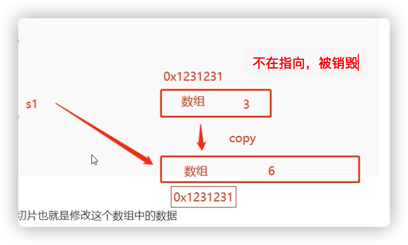

## 1、切片

### 切片的定义

切片就是动态数组，引用类型传递，<mark>与数组相比切片的长度不固定，可以追加元素，容量增大</mark>

切片是一种方便，灵活且强大的包装器，切片本身没有任何数据，他们只是对现有数组的引用

从概念上说，slice像一个结构体，包括三个元素：

- 指针，指向数组中slice指定的开始位置
- 长度：
- 最大长度：slice开始位置到数组的最后位置的长度

```go
func main() {

	// 定义数组，必须指定长度
	arr := [5]int{1, 2, 3, 4}
	fmt.Println(arr)

	// 定义切片,没定义数据,还没有创建对象
	var s1 []int
	fmt.Println(s1)

	// 判断 切片s1为空
	if s1 == nil {
		fmt.Println("切片为空")
	}
  s1 = make([]int,0,1) // 创建对象 T 数据类型，length长度，capacity容量

  // 定义切片，带有数据
	s2 := []int{1, 2, 3}
	fmt.Println(s2)
	fmt.Printf("%T,%T,%T\n", arr, s1, s2)

	// 使用与数组相似
	fmt.Println(s2[0])
	//fmt.Println(s1[0]) // index out of range [0] with length 0 ,切片没有元素
}
```

使用 nil 关键字判断变量是否为空，执行结果：

```sh
[1 2 3 4 0]
[]
切片为空
[1 2 3]
[5]int,[]int,[]int
1
```

### make函数创建切片

```go
make([]T,length,capacity) // T 数据类型，length长度，capacity容量
```

切片是可索引的，并且可以由len方法获取长度

```go
func main() {
	// 定义切片，长度是5，初始化了 [0 0 0 0 0]，有数据，不再是nil 空切片
	s1 := make([]int, 5, 10)
	fmt.Println(s1)
	fmt.Println(len(s1))
	fmt.Println(cap(s1))

	s1[1] = 100
	// s1[6] = 200 // 编译不会报错，运行时就会报 超出下标： runtime error: index out of range [6] with length 5
}
```

发现，make定义了切片的长度，通过下标的fa

### 切片扩容

就跟java的ArrayList一样，超出了初始容量，可以自动扩容，应该也会有一个扩容因子的概念

```go
func main() {
	s1 := make([]int, 0, 5)
	s1 = append(s1, 1, 2)
	fmt.Println(s1)
	// 如果切片中的数据超过了初始容量，切片会自动扩容
	s1 = append(s1, 3, 4, 5, 6, 7, 8)
	fmt.Println(s1)

	// 把一个切片中的数据添加到另外一个切片中
	s2 := []int{1, 1, 1, 1}
	s1 = append(s1, s2...)
	fmt.Println(s1)
}
```

执行结果：

```sh
[1 2]
[1 2 3 4 5 6 7 8]
[1 2 3 4 5 6 7 8 1 1 1 1]
```

### 切片遍历

```go
func main() {
	s1 := make([]int, 0, 5)
	s1 = append(s1, 1, 2)
	fmt.Println(s1)
	// 如果切片中的数据超过了初始容量，切片会自动扩容
	s1 = append(s1, 3, 4, 5, 6, 7, 8)
	fmt.Println(s1)

	// 把一个切片中的数据添加到另外一个切片中
	s2 := []int{1, 1, 1, 1}
	s1 = append(s1, s2...)
	fmt.Println(s1)

	for i := range s1 {
		fmt.Println(s1[i])
	}
  
  for _, v := range s1 {  // 下标是匿名变量被丢弃，v是元素值
		fmt.Println(v)
	}
}
```

### 切片扩容内存分析

切片容量的扩容因子是2，超出当前容量(不超出不扩容)，**切片就会以2倍原来容量来进行扩容**，就会开辟一块新的内存空间，把原来的数据拷贝到新的内存空间，切片指向新的内存空间，内存地址发生变化，旧的内存空间会被当作垃圾被go回收

```go
// 每个切片的底层引用了数组
// 切片本身不存储数据，都是底层数组存储数据的，所以修改了切片也就是修改了数组的数据
// 3、向切片添加数据，如果没超过容量，
// 4、切片一旦扩容，
func main() {
	s1 := []int{1, 2, 3}
	fmt.Println(s1)
	fmt.Printf("len:%d,cap:%d\n", len(s1), cap(s1))
	fmt.Printf("%p\n", s1) // 打印切片s1的内存地址

	s1 = append(s1, 4, 5)
	fmt.Println(s1)
	fmt.Printf("len:%d,cap:%d\n", len(s1), cap(s1))
	fmt.Printf("%p\n", s1) // 打印切片s1的内存地址

	s1 = append(s1, 6, 7, 8)
	fmt.Println(s1)
	fmt.Printf("len:%d,cap:%d\n", len(s1), cap(s1))
	fmt.Printf("%p\n", s1) // 打印切片s1的内存地址

	s1 = append(s1, 9, 11, 12)
	fmt.Println(s1)
	fmt.Printf("len:%d,cap:%d\n", len(s1), cap(s1))
	fmt.Printf("%p\n", s1) // 打印切片s1的内存地址

	s1 = append(s1, 13, 14)
	fmt.Println(s1)
	fmt.Printf("len:%d,cap:%d\n", len(s1), cap(s1))
	fmt.Printf("%p\n", s1) // 打印切片s1的内存地址
}
```

执行结果：

```sh
[1 2 3]
len:3,cap:3
0xc0000220c0
[1 2 3 4 5]
len:5,cap:6
0xc000018120
[1 2 3 4 5 6 7 8]
len:8,cap:12
0xc00001c5a0
[1 2 3 4 5 6 7 8 9 11 12]
len:11,cap:12
0xc00001c5a0
[1 2 3 4 5 6 7 8 9 11 12 13 14]
len:13,cap:24
0xc000106000
```

- 每个切片引用了一个底层数组
- 切片本身不存储数据，都是底层数组存储的，所以修改切片就是修改数组的数据
- 当向切片中添加数据时，
  - 如果没有超过容量，直接添加
  - 如果超过容量，自动扩容，成倍增加，并copy原底层数组数据到新的底层数组
- 切片扩容完成，重新指向一个新的底层数组




### 在已有数组上创建切片

从已有数组上直接创建切片，该切片的底层数组就是当前数组，<mark>长度是从start 到 end切割的数据量，容量是从start到数组的末尾</mark>

```go
slice := arr[start:end]
```

```go
func main() {
	arr := [10]int{1, 2, 3, 4, 5, 6, 7, 8}
	fmt.Println("通过数组创建切片")
  // 通过数组创建切片
	s1 := arr[:5] // 下标从0到5，不包括5
	fmt.Println(s1)
	fmt.Printf("len:%d,cap:%d\n", len(s1), cap(s1))  // 长度5，容量10
	fmt.Printf("切片内存地址：%p，数组内存地址:%p\n", s1, &arr)

	s2 := arr[5:] // 从下标5到末尾
	fmt.Println(s2)
	fmt.Printf("len:%d,cap:%d\n", len(s2), cap(s2))
	fmt.Printf("切片内存地址：%p，数组内存地址:%p\n", s2, &arr)

	s3 := arr[3:8] // 从下标3到8
	fmt.Println(s3)
	fmt.Printf("len:%d,cap:%d\n", len(s3), cap(s3))
	fmt.Printf("切片内存地址：%p，数组内存地址:%p\n", s3, &arr)

	s4 := arr[:] // 整个数组
	fmt.Println(s4)
	fmt.Printf("len:%d,cap:%d\n", len(s4), cap(s4))
	fmt.Printf("切片内存地址：%p，数组内存地址:%p\n", s4, &arr)

	s1 = append(s1, 1, 1, 1, 1, 1, 1, 1)
	fmt.Printf("切片s1扩容后的内存地址：%p\n", s1) // 扩容后，切片指向新的底层数组
	fmt.Printf("数组的内存地址：%p\n", &arr)
  
  // 修改原数组的内容，切片也会发生变化,说明切片指向的底层数组还是原数组
	arr[2] = 100
	arr[7] = 100
	fmt.Println(arr)
	fmt.Println(s1)
	fmt.Println(s2)
	fmt.Println(s3)
	fmt.Println(s4)
}
```

执行结果：

```sh
通过数组创建切片
[1 2 3 4 5]
len:5,cap:10
切片内存地址：0xc0000280f0，数组内存地址:0xc0000280f0
[6 7 8 0 0]
len:5,cap:5
切片内存地址：0xc000028118，数组内存地址:0xc0000280f0
[4 5 6 7 8]
len:5,cap:7
切片内存地址：0xc000028108，数组内存地址:0xc0000280f0
[1 2 3 4 5 6 7 8 0 0]
len:10,cap:10
切片内存地址：0xc0000280f0，数组内存地址:0xc0000280f0
切片s1扩容后的内存地址：0xc00007c000
数组的内存地址：0xc0000280f0
[1 2 100 4 5 6 7 100 0 0]
[1 2 3 4 5 1 1 1 1 1 1 1]
[6 7 100 0 0]
[4 5 6 7 100]
[1 2 100 4 5 6 7 100 0 0]
```

可以发现，切片没有截断数组的情况下，切片只需指向原数组

<mark>切片本身不保存数组</mark>，只是做指向

```go
arr := [10]int{1, 2, 3, 4, 5, 6, 7, 8}
	fmt.Println("通过数组创建切片")
	s1 := arr[:5] // 下标从0到5，不包括5
	fmt.Println(s1)
	fmt.Printf("len:%d,cap:%d\n", len(s1), cap(s1))
	fmt.Printf("切片内存地址：%p，数组内存地址:%p\n", s1, &arr)

	s2 := arr[5:] // 从下标5到末尾
	fmt.Println(s2)
	fmt.Printf("len:%d,cap:%d\n", len(s2), cap(s2))
	fmt.Printf("切片内存地址：%p，数组内存地址:%p\n", s2, &arr)

	s3 := arr[3:8] // 从下标3到8
	fmt.Println(s3)
	fmt.Printf("len:%d,cap:%d\n", len(s3), cap(s3))
	fmt.Printf("切片内存地址：%p，数组内存地址:%p\n", s3, &arr)

	s4 := arr[:] // 整个数组
	fmt.Println(s4)
	fmt.Printf("len:%d,cap:%d\n", len(s4), cap(s4))
	fmt.Printf("切片内存地址：%p，数组内存地址:%p\n", s4, &arr)

	s1 = append(s1, 1, 1, 1) // 没有扩容
	// s1 = append(s1, 1, 1, 1, 1, 1, 1, 1)
	fmt.Printf("切片s1扩容后的内存地址：%p\n", s1) // 扩容后，切片指向新的底层数组
	fmt.Printf("数组的内存地址：%p\n", &arr)

	// 修改原数组的内容，切片也会发生变化
	arr[2] = 100
	arr[7] = 100
	fmt.Println(arr)
	fmt.Println(s1)
	fmt.Println(s2)
	fmt.Println(s3)
	fmt.Println(s4)
```

执行结果：

```sh
通过数组创建切片
[1 2 3 4 5]
len:5,cap:10
切片内存地址：0xc0000b6000，数组内存地址:0xc0000b6000
[6 7 8 0 0]
len:5,cap:5
切片内存地址：0xc0000b6028，数组内存地址:0xc0000b6000
[4 5 6 7 8]
len:5,cap:7
切片内存地址：0xc0000b6018，数组内存地址:0xc0000b6000
[1 2 3 4 5 6 7 8 0 0]
len:10,cap:10
切片内存地址：0xc0000b6000，数组内存地址:0xc0000b6000
切片s1扩容后的内存地址：0xc0000b6000
数组的内存地址：0xc0000b6000
[1 2 100 4 5 1 1 100 0 0]
[1 2 100 4 5 1 1 100]
[1 1 100 0 0]
[4 5 1 1 100]
[1 2 100 4 5 1 1 100 0 0]
```

发现，切片没有扩容的情况下，底层指向的是原数组，修改切片的值，原数组的值也会发生变化，指向同一个底层数组的切片，根据下标获取的值也会发生变化

### 切片是引用类型

```go
func main() {
	// 值类型，拷贝数据
	arr1 := [4]int{1, 2, 3, 4}  // 数组的固定长度的
	arr2 := arr1
	fmt.Println(arr1, arr2)
	arr2[0] = 100
	fmt.Println(arr1, arr2)
	fmt.Printf("%p,%p\n", &arr1, &arr2) // 不同的内存地址

	// 引用类型，指向同一个内存地址
	s1 := []int{1, 2, 3, 4}
	s2 := s1
	fmt.Println(s1, s2)
	s2[0] = 100
	fmt.Println(s1, s2)
	fmt.Printf("%p,%p\n", s1, s2) // 相同的内存地址
}
```

执行结果

```sh
[1 2 3 4] [1 2 3 4]
[1 2 3 4] [100 2 3 4]
0xc00001e060,0xc00001e080
[1 2 3 4] [1 2 3 4]
[100 2 3 4] [100 2 3 4]
0xc00001e140,0xc00001e140
```

### 深拷贝与浅拷贝

深拷贝：拷贝的是数据本身

- 值类型的数据，默认都是深拷贝：array数组，int，float，string，bool,struct结构体

**浅拷贝：拷贝的是数据地址，会导致多个变量指向同一块内存地址**

- 引用类型的数据默认都是浅拷贝：slice，map
- 切片是引用类型，直接拷贝的是地址

### 实现切片深拷贝

```go
func main() {
	s1 := []int{1, 2, 3, 4}
	s2 := make([]int, 0, 0)

	// 实现切片深拷贝，循环赋值
	for i := 0; i < len(s1); i++ {
		s2 = append(s2, s1[i])
	}

	// copy函数，切片的底层是数组，
	s3 := []int{4, 5, 6}
	fmt.Println(s3)
	fmt.Println(s1)
	copy(s1, s3) // s3的数据拷贝到s1，注意不是append追加
	fmt.Println(s3)
	fmt.Println(s1)
}
```

执行结果：

```sh
[4 5 6]
[1 2 3 4]
[4 5 6]
[4 5 6 4]
```

### 切片本质是指针变量


## 2、Map讲解

跟java的Map一样，是一种无序的键值对集合，Map最重要的一点是通过key来快速检索数据

Map是一种集合，我们可以像遍历数组和切片那样遍历它

### Map的声明与初始化

```go
func main() {
	// map类型的定义,格式 map[key]value
	var map1 map[int]string // 声明 map1对象还没有创建 等于 nil
  if map1 == nil {
		fmt.Println("map1为空")
	}
	// make函数定义map
	var map2 = make(map[string]string) // map2对象已经创建，里面没有元素
	// 初始化数据创建map
	var map3 = map[string]int{"go": 100, "java": 80, "c": 70}

	// map1[0] = "jacob" // map1==nil 还没有创建对象，不能添加元素 panic: assignment to entry in nil map
	map2["haha"] = "hehe"

	fmt.Println(map1)
	fmt.Println(map2)
	fmt.Println(map3)
  fmt.Printf("%T\n", map3) // 打印数据类型

	// 判断对象是否为空 nil 相当于java的null
	fmt.Println(map1 == nil) // true map1对象还没有创建
	fmt.Println(map2 == nil) // false map1对象已经创建，里面没有元素
}
```

执行结果：

```sh
map[]
map[haha:hehe]
map[c:70 go:100 java:80]
true
false
```


### Map的使用

- 创建并初始化 make
- map[key]=value，将value赋值给对应map的key
- 判断key是否存在，value, ok

```go
func main() {
	// 声明 ，还没有创建对象，等于nil
	var map1 map[int]string
	// 创建
	map1 = make(map[int]string)

	// 存储键值对
	map1[1] = "xuexiangban"
	map1[3] = "kuangshen"
	map1[5] = "feige"
	fmt.Println(map1)

	// 获取map的数据
	fmt.Println(map1[1])
	fmt.Println(map1[2]) // key不存在，则获取默认值，int=0,string=""空字符串

	// 通过ok-idom来判断 key,value 是存在
	value, ok := map1[6]
	if ok {
		fmt.Println("map key 存在，value:", value)
	} else {
		fmt.Println("map key 不存在")
	}

	// 修改数据
	map1[1] = "hahaha"
	fmt.Println(map1)

	// 删除数据 delete
	delete(map1, 1) // 1 是key
	fmt.Println(map1)

	// 获取map的长度
	fmt.Println(len(map1))
	// key存在就是修改，不存在就是新增
	map1[10] = "hello"
	fmt.Println(len(map1))
}
```

执行结果：

```sh
map[1:xuexiangban 3:kuangshen 5:feige]
xuexiangban

map key 不存在
map[1:hahaha 3:kuangshen 5:feige]
map[3:kuangshen 5:feige]
2
3
```

### Map的遍历

rang遍历

```go
func main() {
	var map1 = map[string]int{"Go": 100, "Java": 90, "Python": 89}

	// map是无序的
	for k, v := range map1 {
		fmt.Println(k, v)
	}
}
```

执行结果：

```sh
Python 89
Go 100
Java 90
```

使用map过程中要注意的几点：

- map是无序的，每次打印出来的map可能都不一样
- map的长度是不固定的，和切片slice一样，是一种引用类型
- 内置的len函数返回map的key的数量
- map的key是所有可比较的类型，如bool、整型、string、float

## 3、整合切片与Map

需求：

1. 创建map来存储个人信息：name、age、sex、addr
2. 每个map存一个人的信息
3. 将这些map存入到切片slice中
4. 遍历输出个人信息

相当于Java的`List<Map<String,Object>>`使用

```go
func main() {
	var user1 = map[string]string{"name": "kuangshen", "age": "18", "sex": "男", "addr": "重庆"}
	user2 := make(map[string]string)
	user2["name"] = "feige"
	user2["age"] = "30"
	user2["sex"] = "男"
	user2["addr"] = "广州"

	user3 := map[string]string{"name": "xiaohong", "age": "20", "sex": "女", "addr": "中国"}

	userList := make([]map[string]string, 0, 10)
	userList = append(userList, user1)
	userList = append(userList, user2)
	userList = append(userList, user3)

	for _, v := range userList {
		fmt.Printf("name:%s,", v["name"])
		fmt.Printf("age:%s,", v["age"])
		fmt.Printf("sex:%s,", v["sex"])
		fmt.Printf("addr:%s\n", v["addr"])
	}
}
```

执行结果：

```sh
name:kuangshen,age:18,sex:男,addr:重庆
name:feige,age:30,sex:男,addr:广州
name:xiaohong,age:20,sex:女,addr:中国
```


