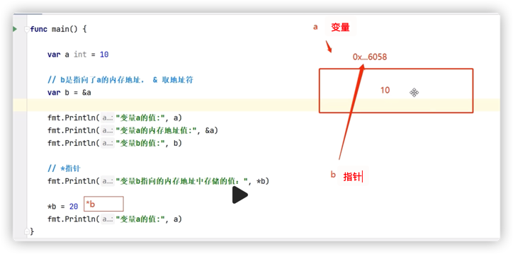
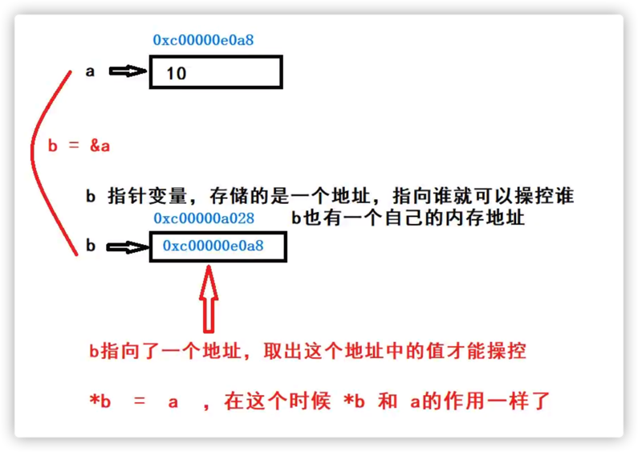
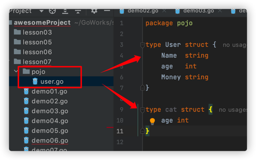
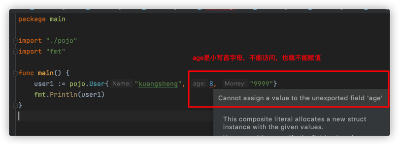

## 1、初识指针

<mark>指针是一个特殊的变量，它的值是一个内存地址</mark>，存储另外一个变量的内存地址

- & 取地址符
- *指针，取出对应内存地址的空间存储的值

```go
func main() {

	a := 10
	// & 是取地址符，变量a的内存地址赋值给b
	var b = &a
	fmt.Println("变量a的值：", a)
	fmt.Println("变量a的内存地址：", &a)
	fmt.Println("变量b的值：", b)

	// *指针，取出对应内存地址的空间存储的值
	fmt.Println("变量b指向的内存地址中存储的值：", *b)

	*b = 20
	fmt.Println("变量a的值：", a)

```

指向结果：

```sh
变量a的值： 10
变量a的内存地址： 0xc000024080
变量b的值： 0xc000024080
变量b指向的内存地址中存储的值： 10
变量a的值： 20
```




```sh
指针的概念
b的内存地址0x111111111,值：500，var b int = 500
a指针变量，指向了内存地址0x111111111,
变量a持有了变量b的地址，这就是a指向了b
```

&取地址符




## 2、指针的使用

使用流程：

- 定义指针变量
- 为指针变量赋值
- 访问指针变量指向地址的值，通过*指针变量获取内容

```go
func main() {
	var a int = 10
	fmt.Println("a变量的值：", a)
	fmt.Println("a变量的内存地址：", &a)

	// 声明一个指针变量
	var p *int
	// 给指针变量赋值内存地址
	p = &a

	fmt.Println("指针变量p存储的内存地址：", p) // a的内存地址
	fmt.Println("指针变量p的内存地址：", &p) // p的内存地址
	fmt.Println("*p变量的值：", *p) // a的值

	*p = 20
	fmt.Println("a变量的值：", a)
	fmt.Println("*p变量的值：", *p)

	// 指向指针的指针，嵌套使用
	// 声明指针变量ptr，来指向指针变量p
	var ptr **int
	ptr = &p
	fmt.Println("ptr存储的指针地址：", ptr)
	fmt.Println("ptr指针变量自己的内存地址：", &ptr)
	fmt.Println("*ptr 变量的值，即a的内存地址：", *ptr)
	fmt.Println("**ptr 变量的地址存储的值，即a的值", **ptr)

	// 改变变量a的值
	**ptr = 100
	fmt.Println("a变量的值：", a)
	fmt.Println("*p变量的值", *p)
}
```

指向结果：

```sh
a变量的值： 10
a变量的内存地址： 0xc000024080
指针变量p存储的内存地址： 0xc000024080
指针变量p的内存地址： 0xc000012030
*p变量的值： 10
a变量的值： 20
*p变量的值： 20
ptr存储的指针地址： 0xc000012030
ptr指针变量自己的内存地址： 0xc000012038
*ptr 变量的值，即a的内存地址： 0xc000024080
**ptr 变量的地址存储的值，即a的值 20
a变量的值： 100
*p变量的值 100
```

**go语言使用指针就很方便的操作其他变量，尽管那个变量不可以直接访问，但是可以通过指针指向那个变量的值来进行修改**。

指针是特殊的变量，它存储的是别的变量的内存地址，它可以操控别的变量

## 3、指针与数组

区分：

- 数组指针：指向一个数组的指针

  ```go
  func main() {
  	// 定义一个数组，有固定的长度4
  	var arr1 = [4]int{1, 2, 3, 4}
  	fmt.Printf("arr1的地址：%p\n", &arr1)
  	// 声明一个指针，指向数组arr1
  	var p1 *[4]int
  	// 给指针赋值
  	p1 = &arr1
  	fmt.Printf("p1->地址：%p\n", p1)
  	fmt.Println("p1自己的地址：", &p1)
  	fmt.Println("p1->地址->值：", *p1)
  
  	// 通过指针修改数组的元素的值
  	(*p1)[0] = 100
  	fmt.Println(arr1)
  	fmt.Println(*p1)
  
  	// 简化写法，指针指向谁就代表谁，这里指针p1就代表arr1
  	p1[0] = 200
  	fmt.Println(arr1)
  	fmt.Println(*p1)
  }
  ```

  <mark>指针指向谁就代表谁</mark>

  执行结果：

  ```sh
  arr1的地址：0xc00001e060
  p1->地址：0xc00001e060
  p1自己的地址： 0xc000012030
  p1->地址->值： [1 2 3 4]
  [100 2 3 4]
  [100 2 3 4]
  [200 2 3 4]
  [200 2 3 4]
  ```

  指针指向谁就代表谁，这里指针p1就代表arr1

- 指针数组：首先是一个数组，存储的数据类型是指针

  ```go
  func main() {
  	// 指针数组
  	a := 1
  	b := 2
  	c := 3
  	d := 4
  	// 定义一个指针数组
  	arr2 := [4]*int{&a, &b, &c, &d}
  	fmt.Println(arr2)
  	// 通过指针修改数组元素指向的变量
  	*arr2[0] = 500
  	fmt.Println(a) // 500
  
  	// 修改变量a,通过指针来获取值
  	a = 100
  	fmt.Println(*arr2[0]) // 100
  }
  
  ```

  执行结果：

  ```sh
  [0xc000024090 0xc000024098 0xc0000240a0 0xc0000240a8]
  500
  100
  ```

  指针结合切片、Map的使用与上面的类似

## 4、指针与函数

### 返回值是一个指针

```go
func main() {
	ptr := f1()
	fmt.Printf("ptr->地址：%p\n", ptr)
	fmt.Printf("ptr的数据类型：%T\n", ptr)
	fmt.Println("ptr的地址", &ptr)
	fmt.Println("ptr->地址->值", *ptr)
	fmt.Println(ptr[0]) // 指针ptr代表的数组arr1
}

// 声明一个函数，返回结果是一个数组指针
func f1() *[4]int {
	arr1 := [4]int{1, 2, 3, 4}
	return &arr1
}
```

我们就可以通过指针操作函数里面的局部变量，

执行结果：

```sh
ptr->地址：0xc0000b6000
ptr的数据类型：*[4]int
ptr的地址 0xc0000a6018
ptr->地址->值 [1 2 3 4]
1
```

### 指针作为参数

以前值传递的int等，通过传递指针，就变成了跟引用传递一样的效果，因为指针存储的是地址，函数就可以直接修改传入参数了，因为形参与实参指向的同一块内存地址。

```go
func main() {
	a := 10
	fmt.Println("a=", a)
	f2(&a)
	fmt.Println("a=", a)
}

// 指针作为入参
func f2(ptr *int) {
	fmt.Println("ptr:", ptr)
	fmt.Println("*ptr:", *ptr)
	*ptr = 100
}
```

执行结果：

```sh
a= 10
ptr: 0xc0000ac008
*ptr: 10
a= 100
```

<mark>通过指针可以操作值传递的变量</mark>,突破了值传递的限制

指针是非常灵活的，它可以是：

- 返回值（出参数）
- 入参数
- 数组的元素、切片的元素，Map的元素

使用的时候，只需要注意一个点：<mark>指针指向了谁</mark>

什么时候定义的变量会销毁，没有任何东西指向它的时候，垃圾回收器GC就会回收它。


## 5、结构体的定义与使用

我觉得结构体的概念来源于C中的结构体，就相当于Java里封装一个实体类(PO,DTO,VO)，一个对象。

<mark>面向对象思维OOP：将世界上的所有东西，抽象成一个个的类（属性、方法）</mark>

go语言中：

结构体是由一系列具有相同类型或不同类型的变量数据构成的数据集合

结构体表示一项纪录，比如保存人的信息，有以下属性：

- name 名字
- age 年龄
- sex 性别

> 定义结构体

结构体定义需要使用type和struct语句

- type 设定结构体的名称
- struct  语句定义一个新的数据类型

```go
// 定义一个结构体 User
// User 结构体名称，开头大小写字母跟权限有关，小写user表示是私有的，只能在当前go文件内部访问
// 大写User表示公有的，当前go文件外部也可以访问
type User struct{
  name string
  age int
  sex string
}
```

例子：

```go
// 定义一个结构体
// User 访问权限相关，小写user 私有，大写User 公有
type User struct {
	name string
	age  int
	sex  string
}

func main() {
	// 1、创建User对象，成员变量会有默认值
	var user1 User
	// 打印，发现对象user1的成员变量是有默认值的，int默认0,string默认空字符串
  fmt.Println(user1) // { 0 }
	// 赋值，xxx.属性 = 值
	user1.name = "kuangshen"
	user1.age = 18
	user1.sex = "男"
	fmt.Println(user1)
	fmt.Println(user1.name)

	// 2、简单写法
	user2 := User{}
	// 赋值
	user2.name = "feige"
	user2.age = 30
	user2.sex = "男"
	fmt.Println(user2.name)

	// 3、定义并赋值
	user3 := User{
		name: "xuexiangban",
		age:  2,
		sex:  "男",
	}
	fmt.Println(user3)

	// 4、按照结构体的成员变量赋值，可以忽略字段名称
	user4 := User{"xiaoming", 20, "女"}
	fmt.Println(user4)
}
```

执行结果：

```sh
{ 0 }
{kuangshen 18 男}
kuangshen
feige
{xuexiangban 2 男}
{xiaoming 20 女}
```

结构体的使用都是通过.来获取

## 6、结构体的指针应用

go语言中，<mark>结构体是值类型传递的</mark>，java中类的使用都是引用类型传递的

<mark>使用内置函数new()创建，new的所有Type都是返回指针</mark>

```go
user1:=new(User) // 没想到go语言也使用new关键字
```

推导结构体是值类型的例子：

```go
type User struct {
	name string
	age  int
	sex  string
}

func main() {
	fmt.Println("推导结构体是值类型的")
	user1 := User{"kuangshen", 18, "男"}
	fmt.Println(user1)
	// 赋值给user2,修改user2的值，如果user1的值没有变化，说明结构体是值类型的
	user2 := user1
	user2.name = "feige"
	fmt.Println(user1)
	fmt.Println(user2)

	// 通过指针修改结构体
	var user3 *User // 声明User类型的指针
	user3 = &user1 // 结构体变量user1的内存地址赋值给指针user3
	// (*user3).name = "zhangsan"
	user3.name = "zhangsan"
	fmt.Println(user1) // user1的name变为zhangsan

	//  new 创建结构体，返回结构体指针，突破了结构体是
	user4 := new(User)
	// 打印user4的数据类型，它是结构体User指针
	fmt.Printf("%T\n", user4) // User类型指针
	user4.name = "qinjiang"
	user4.age = 18
	fmt.Println(user4)
```

执行结果：

```sh
推导结构体是值类型的
{kuangshen 18 男}
{kuangshen 18 男}
{feige 18 男}
{zhangsan 18 男}
*main.User
&{qinjiang 18 }
```

> new 源码

```go
// The new built-in function allocates memory. The first argument is a type,
// not a value, and the value returned is a pointer to a newly
// allocated zero value of that type.
func new(Type) *Type
```

返回该类型的指针

## 7、匿名结构体

> 匿名变量，匿名函数，匿名结构体，匿名字段

```go
// 定义结构体
type Student struct {
	name string
	age  int
}

type Teacher struct {
	// 匿名字段
	string
	int
}

func main() {
	s1 := Student{"kuangshen", 18}
	fmt.Println(s1.name)

	// 定义一个匿名结构体对象，并赋值
	s2 := struct {
		name string
		age  int
	}{"zhangsan", 30}
	fmt.Println(s2.name)

	// 创建匿名字段的结构体对象
	t1 := Teacher{"qinjiang", 27}
	fmt.Println(t1)
	fmt.Println(t1.string)
}
```

执行结果

```sh
kuangshen
zhangsan
{qinjiang 27}
qinjiang
```

## 8、结构体嵌套

一个结构体的字段是另外一个结构体，这就叫做结构体嵌套

```go
type Address struct {
	city, state string
}

type Person struct {
	name string
	age  int
	// 结构体嵌套,has a 关系
	addr Address
}

func main() {
	person1 := Person{}
	person1.name = "kuangshen"
	person1.age = 18
	person1.addr = Address{"广州", "中国"}

	fmt.Println(person1)
	fmt.Println(person1.addr)
}
```

执行结果：

```sh
{kuangshen 18 {广州 中国}}
{广州 中国}
```

## 9、结构体导出访问

- 如果结构体名称首字母小写，这结构体不会被导出
- 如果结构体名称首字母大写，则结构体可被导出，但只会导出大写首字母的成员字段，那些小写首字母的成员字段不会被导出
- 如果存在嵌套结构体，即使嵌套的结构体字段首字母小写，外部也能访问到其中首字母大写的成员字段

正常开发，会把结构体放到一个独立的package包中




```go
package pojo

// 大写首字母就是外部可以访问的，相当于java的public
type User struct {
	Name  string // 大写首字母字段外部包可以访问使用（导出）
	age   int // 小写首字母字段外部包不可以访问使用（不能导出）
	Money string // 大写首字母字段外部包可以访问使用（导出）
}

// 小写首字母，外部不可以访问的，private
type cat struct {
	age int // 小写首字母字段外部不可以访问
}
```

引入pojo包使用里面的结构体

```go
package main

import "./pojo"
import "fmt"

// 程序入口
func main() {
	user1 := pojo.User{}
	user1.Name = "kuangshen"
	user1.Money = "99999"
	
	fmt.Println(user1)
}
```

执行结果：

```sh
{kuangshen 0 99999}  // age是小写首字母字段，外部不可以访问，无法赋值，int 默认0
```


