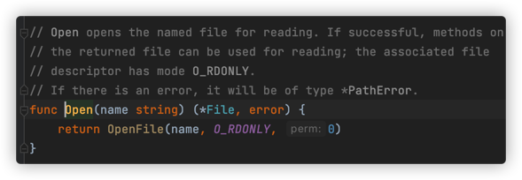
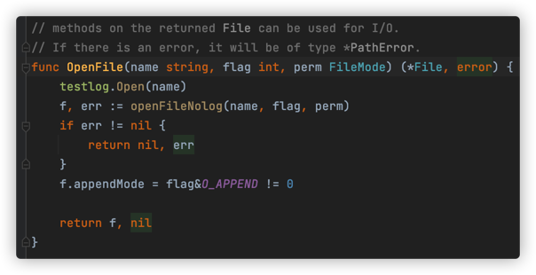
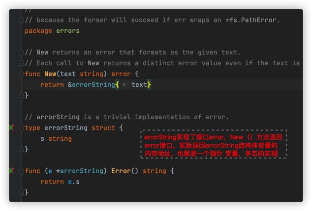
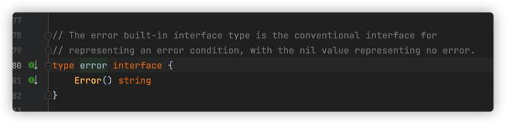
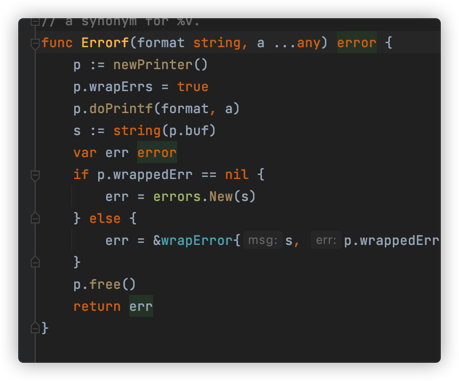

## 1、什么是错误

- 错误：指的是程序中预期会发生的结果，预料之中，错误是业务的一部分
- 异常：不该出现问题的地方出现了问题，预料之外，异常不是业务的一部分

在实际项目中，我们希望通过程序的错误信息快速定位问题，

Go语言没有提供像java,c# 语言中的try...catch异常捕获处理方式，而是通过函数返回值逐层往上抛。

为什么这样设计？

这种设计，鼓励工程师在代码中显示的检查错误，而非忽略错误

- 好处是避免漏掉本应处理的错误
- 弊端是让代码繁琐

go语言中用<mark>内置的error 类型表示</mark>，就像其他的int、float64一样，错误值可以存储在变量中，从函数中返回

例子代码：

```go
import (
	"fmt"
	"os"
)

func main()  {
	// 打开一个文件

	file,err := os.Open("aa.txt")
	if err != nil {
		fmt.Println(err)
    return
	}
	fmt.Println(file.Name())
}
```

执行结果：

```sh
open aa.txt: no such file or directory
```

点进os.Open的源码







## 2、自定义错误

> 创建自己的error错误信息

```go
// 创建一个自己的error错误信息，通过errors创建，返回的是内置的error类型指针对象
errors.New("我是一个错误信息")

// 也可以通过fmt创建
fmt.Errorf("我是一个错误信息，%d\n",500)
```

看源码







```go
import (
	"errors"
	"fmt"
)

func main()  {
	errinfo := errors.New("我是一个错误信息")
	// 打印变量值
	fmt.Println(errinfo)
  fmt.Println(errinfo.Error())
	// 打印变量的数据类型
	fmt.Printf("%T\n",errinfo)  // *errors.errorString 指针变量
  
  err:=setAge(-1)
  	if err !=nil {
		  fmt.Println(err)
	}
}

func setAge(a int) error{
	if a < 0 {
		return errors.New("年龄输入不合法")
	}
	fmt.Println(a)
	return nil
}
```

执行结果：

```sh
我是一个错误信息
我是一个错误信息
*errors.errorString
年龄输入不合法
```

> fmt.Errorf()

源码




```go
	 errinfo2 := fmt.Errorf("我一个错误信息%d",500)
	 fmt.Println(errinfo2)
	fmt.Printf("%T\n",errinfo2)
```

执行结果：

```sh
我一个错误信息500
*errors.errorString
```

error接口的实现类有很多，通过接口断言判断具体是什么类型的错误，然后进行处理

```go
v,ok := err.(错误类型)
```

## 3、错误类型

error是一个接口类型

```go
type error interface {
  Error() string
}
```

```go
func main()  {
  // 返回这个网址的服务地址
	addr,err := net.LookupHost("www.baidu.com")
	fmt.Println(err)

	v,ok := err.(*net.DNSError)
	if ok {
		if v.IsTimeout {
			fmt.Println("超时")
		}else if v.Temporary(){
			fmt.Println("临时错误")
		}else {
			fmt.Println("其他错误")
		}
	}
	fmt.Println(addr)
}
```

执行结果

```sh
<nil>
[182.61.200.7 182.61.200.6]
```

### 自定义错误类型

例子：

```go
type MyDiyError struct {
	msg string
	code int
}

// 实现error 接口
func (e MyDiyError) Error() string {
	return fmt.Sprint("错误信息：",e.msg,"状态码：",e.code)
  // 返回格式化string
	return fmt.Sprintf("错误信息: %s,错误代码:%d",e.msg,e.code)
}

func test1(i int) (int,error)  {
	if i!=0 {
		return i,&MyDiyError{"非零数据",500}
	}
	return i,nil
}

func main()  {
	i,err := test1(1)
	if err !=nil {
		fmt.Println(err)
		myerr,ok :=err.(*MyDiyError) // 指针变量
		if ok {
			fmt.Println(myerr.msg)
			fmt.Println(myerr.code)
      fmt.Println(myerr.Error())
		}
	}
	fmt.Println(i)
}
```

执行结果：

```sh
错误信息：非零数据状态码：500
非零数据
500
1
```

场景举例：购物下单

1. 查询商品信息
2. 查询库存（FindxxxError: msg, code ,）
3. 查询物流


## 4、异常

### panic

- **用来抛出异常**

如果函数中触发了panic语句，会终止其后要执行的代码。在panic所在函数内如果存在要执行的defer函数（延迟执行），则按照defer书写顺序的逆序执行

```go
func main()  {
  test(1)
}

func test(num int) {
	if num == 1 {
		panic("出现异常---panic")
	}
}
```

抛出异常，终止程序执行

```sh
panic: 出现异常---panic
```

例子

```go
func main()  {
	defer fmt.Println("main ---1")
	defer fmt.Println("main ---2")
	fmt.Println("main---3")
    test(1)
	fmt.Printf("main ---4")
	defer fmt.Println("main--5")
}

func test(num int) {
	defer fmt.Println("test ---1")
	defer fmt.Println("test ---2")
	fmt.Println("test---3")
	if num == 1 {
		panic("出现异常---panic")
	}
	fmt.Println("test---4")
}
```

执行结果：

```sh
main---3
test---3
test ---2
test ---1
main ---2
main ---1
```

- 触发panic 程序恐慌
- 逆序执行test函数中的panic前的defer语句
- 逆序执行main函数中test前的defer语句
- 抛出异常

### recover

- **用户恢复异常**

recover的作用是捕获panic的信息，从而恢复正常代码执行

<mark>recover必须配合defer使用</mark>

recover没有传入参数，但是有返回值，返回值就是panic传递的值

```go
func main()  {
	defer fmt.Println("main ---1")
	defer fmt.Println("main ---2")
	fmt.Println("main---3")
    test(1)
	fmt.Println("main ---4")
	defer fmt.Println("main---5")
}

func test(num int) {
	// 匿名函数使用recover接收panic
	defer func () {
		msg := recover() // 获取panic抛出的异常
		if msg !=nil {
			fmt.Println("msg:",msg,"---程序恢复执行")
		}
	}()

	defer fmt.Println("test ---1")
	defer fmt.Println("test ---2")
	fmt.Println("test---3")
	if num == 1 {
		panic("出现异常---panic")
	}
	fmt.Println("test---4")
}
```

执行结果

```sh
main---3
test---3
test ---2
test ---1
msg: 出现异常---panic ---程序恢复执行
main ---4
main ---5
main ---2
main ---1
```

- 触发panic 程序恐慌
- 逆序执行test函数中的panic前的defer语句
- 执行第三条defer时，recover恢复恐慌并输出信息
- 返回外部函数，程序继续执行，就像try catch


## 5、作业


