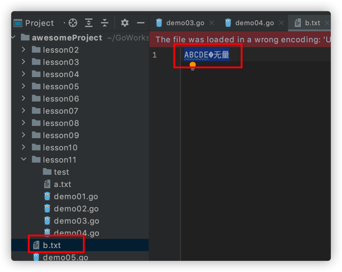
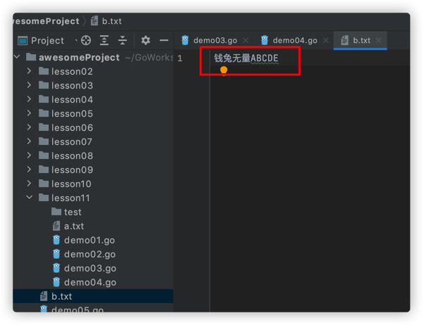
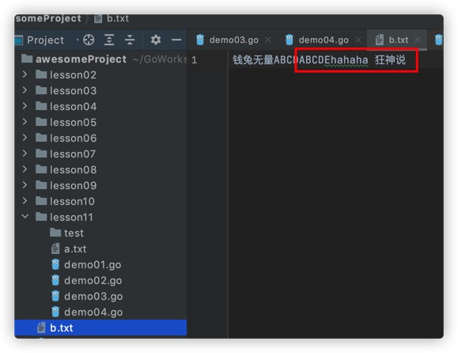
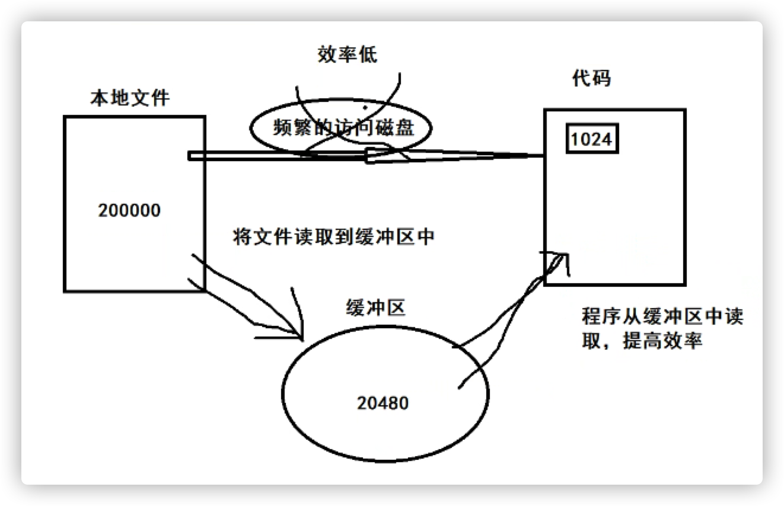
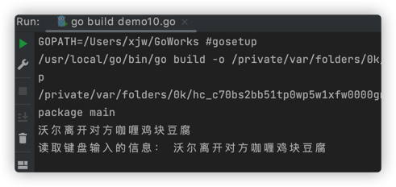

## 1、FileInfo获取文件信息

file类是在os包中，封装了底层的文件描述符和相关信息，同时封装了Read和Write实现

FileInfo接口中定义了file信息相关的方法

```go
type FileInfo interface {
  Name() string // 文件名.扩展名
  Size() int64 // 文件大小，字节数
  Mode() FileMode // 文件权限，-rw-rw-rw-，类似linux的文件权限
  ModTime time.Time // 修改时间
  isDir() bool // 是否文件夹
}
```

### Stat方法

```go
import (
	"fmt"
	"os"
)

func main() {
	// os包下获取文件信息
	fileInfo, err := os.Stat("/Users/xjw/GoWorks/src/awesomeProject/lesson11/a.txt") // 当前目录下a.txt文件
	if err != nil {
		fmt.Println(err)
		return
	}
	fmt.Println(fileInfo.Name())
	fmt.Println(fileInfo.IsDir()) // 是否一个目录
	fmt.Println(fileInfo.Size())  // 文件大小 字节大小
	fmt.Println(fileInfo.Mode())   // 文件权限
	fmt.Println(fileInfo.ModTime()) // 修改时间

	// 反射获取文件更加详细的信息
	fmt.Println(fileInfo.Sys())
}
```

执行结果：

```sh
a.txt
false
12
-rw-r--r--
2023-01-17 23:07:42.795522552 +0800 CST
&{16777220 33188 1 45976985 501 20 0 [0 0 0 0] {1673968036 291220116} {1673968062 795522552} {1673968062 795522552} {1673968036 291220116} 12 8 4096 0 0 0 [0 0]}
```

文件权限科普

> linux下有两种文件权限表示方式：符号和八进制

```sh
1、符号表示
-     rwx     ---     ---
type  owner   group   others

type 文件类型，-代表文件，d代表目录 | 连接符号
---代表的文件读写可执行，字母rwx,如果没有那个权限就用 - 代替

2、八进制表示权限
r  004
w  002
x  001
-  000
// 这里 7=4+2+1 代表可读可写可执行
chmod 777 授权ower group others
r:可读  w:可写  x: 可执行
```

授权脚本

## 2、创建删除目录与文件

> 创建目录 Mkdir，MkdirAll，Remove，

```go
func main() {
  // 创建目录
	err := os.Mkdir("/Users/xjw/GoWorks/src/awesomeProject/lesson11/test", os.ModeDir)
	if err != nil {
		fmt.Println(err)
	}
	// 创建层级文件夹
	err = os.MkdirAll("/Users/xjw/GoWorks/src/awesomeProject/lesson11/test2/a/b", os.ModeDir)
	if err != nil {
		fmt.Println(err)
	}
	fmt.Println("文件夹创建成功")

	// 删除目录或文件
	// Remove 如果存在多层文件，会报错
	// RemoveAll 强制删除 谨慎使用 会删除文件下的所有东西，就像linux的rm -rf 
	err = os.Remove("/Users/xjw/GoWorks/src/awesomeProject/lesson11/test2")
	if err != nil {
		fmt.Println(err) // 文件不存在或文件已删除
	}
}
```

> 创建文件 Create

```go
func main() {
	// 创建文件
	// 返回文件指针与err变量,如果原文件存在，会把文件内容清空，并重新创建
	file, err := os.Create("/Users/xjw/GoWorks/src/awesomeProject/lesson11/b.txt")
	if err != nil {
		fmt.Println(err)
	}
	fmt.Println(file.Name())
	os.Remove("./b.txt") // 可以是相对路径或绝对路径
}
```

## 3、IO读

> OpenFile (文件路径名称，文件打开方式，文件权限)打开文件，要记得使用defer关闭文件

Read 读取文件

```go
package main

import (
	"fmt"
	"os"
)

func main() {
	// 获取文件信息
	fileinfo, err := os.Stat("b.txt")
	fmt.Println(fileinfo.Mode()) // 文件的权限

	// Open打开文件
	// 1、打开文件，建立连接
	// 返回文件指针与error变量
	file, err := os.Open("./b.txt")
	if err != nil {
		fmt.Println(err) 
		return
	}
	fmt.Println(file.Name()) // ./b.txt
	// 关闭文件，使用defer延迟执行关键字，压栈延迟执行
	defer file.Close()

	// 2、读取文件内容
	// 创建切片来接收内容（缓冲区大小与读取文件）
	bs := make([]byte, 1024, 1024) // byte类型，长度为1024，容量1024）
	// Read到容器，返回读取的数量n 与 err变量，后续可以使用for循环判断n>0读取文件的所有内容
  // 直到返回n==0,光标移动到了文件的末尾，同时返回err=io.EOF
	// 如果读到文件的末尾，err = io.EOF
	n, err := file.Read(bs)
	fmt.Println(n) // 12
	fmt.Println(string(bs)) // 钱兔无量
	fmt.Println(err) // nil
	n, err = file.Read(bs)
	fmt.Println(n) // 0 光标移动到文件的末尾，返回0
	fmt.Println(string(bs)) // 上一次读取的值钱兔无量
	fmt.Println(err) // EOF

	// OpenFile (文件路径名称，文件打开方式，文件权限) 返回文件指针与error变量
	file2, err := os.OpenFile("b.txt", os.O_RDONLY|os.O_WRONLY, os.ModePerm)
	if err != nil {
		fmt.Println(err)
		return
	}
	fmt.Println(file2.Name()) // b.txt
	defer file2.Close()
}
```

执行结果：

```sh
-rw-r--r--
./b.txt
12
钱兔无量
<nil>
0
钱兔无量
EOF
b.txt

```

查看file.Read方法源码

```go
// Read reads up to len(b) bytes from the File and stores them in b.
// It returns the number of bytes read and any error encountered.
// At end of file, Read returns 0, io.EOF.
func (f *File) Read(b []byte) (n int, err error) {
	if err := f.checkValid("read"); err != nil {
		return 0, err
	}
	n, e := f.read(b)
	return n, f.wrapErr("read", e)
}
```

## 4、IO写

### Write 追加写入

```go
func main()  {
	// 打开文件，创建连接
	file2, err := os.OpenFile("b.txt", os.O_RDONLY|os.O_WRONLY, os.ModePerm)
	if err != nil {
		fmt.Println(err)
		return
	}
	// 养成习惯，defer延迟关闭文件
	defer file2.Close()
	// 定义一个字节切片，存储数据
	bs:=[]byte{65,66,67,68,69}
	n,err :=file2.Write(bs)
	if err != nil {
		fmt.Println(err)
		return
	}
	// 打印返回的行数
	fmt.Println(n) // 5
}
```

看写入的文件 b.txt




发现把原来文件的部分内容干没了，从开头写入 `ABCDE` 5个字符

我们要把写入内容追加到文件末尾，而不是从头开始写入，增加打开方式 `os.O_APPEND`

```go
func main()  {
	// 打开文件，创建连接
	file2, err := os.OpenFile("b.txt", os.O_RDONLY|os.O_WRONLY|os.O_APPEND, os.ModePerm) // 追加
	if err != nil {
		fmt.Println(err)
		return
	}
	// 养成习惯，defer延迟关闭文件
	defer file2.Close()
	// 定义一个字节切片，存储数据
	bs:=[]byte{65,66,67,68,69}
	n,err :=file2.Write(bs)
	if err != nil {
		fmt.Println(err)
		return
	}
	// 打印返回的行数
	fmt.Println(n) // 5
}
```

恢复 b.txt文件内容，执行上面代码，看输出结果




### WriteString字符串写入

```go
func main()  {
	// 打开文件，创建连接，方式：O_RDONLY 可读，O_WRONLY可写，O_APPEND追加，O_CREATE创建文件
	file2, err := os.OpenFile("b.txt", os.O_RDONLY|os.O_WRONLY|os.O_APPEND, os.ModePerm)
	if err != nil {
		fmt.Println(err)
		return
	}
	// 养成习惯，defer延迟关闭文件
	defer file2.Close()
	// 定义一个字节切片，存储数据
	bs:=[]byte{65,66,67,68,69}
	n,err :=file2.Write(bs)
	if err != nil {
		fmt.Println(err)
		return
	}
	// 打印返回的行数
	fmt.Println(n)

	n,err = file2.WriteString("hahaha 狂神说")
	fmt.Println(n) // 16
}
```

执行文件，看文件b.txt的内容




## 5、复制

### 手动复制

创建两个文件的连接，读取一个文件的内容，写到另外一个文件。

1. 编写函数，源文件，目标地址，缓冲区
2. 读取源文件，保存到缓冲区
3. 读取缓冲区内容，将内存写到新的文件中
4. 要判断文件读取完毕

```go
package utils

import (
	"fmt"
	"io"
	"os"
)

func Copy(source, detination string, buffersize int) {
	// 输入文件
	file1, err := os.OpenFile(source, os.O_RDONLY, os.ModePerm)
	if err != nil {
		fmt.Println("open文件file1错误", err)
		return
	}
	defer file1.Close()
	// 输出文件(可创建的)
	file2, err := os.OpenFile(detination, os.O_RDWR|os.O_CREATE, os.ModePerm)
	if err != nil {
		fmt.Println("open文件file2错误", err)
		return
	}
	defer file2.Close()
	// 缓冲区
	buf := make([]byte, buffersize)
	for {
		n, err := file1.Read(buf)
		if n == 0 || err == io.EOF {
			fmt.Println("文件复制完毕")
			break
		}
		_, err = file2.Write(buf[:n])
		if err != nil {
			fmt.Println("文件写入错误", err)
			break
		}
	}
}
```

main函数入口

```go
func main() {
	source := "/Users/xjw/GoWorks/src/awesomeProject/lesson11/layui.png"
	destination := "/Users/xjw/GoWorks/src/awesomeProject/layui" + strconv.FormatInt(time.Now().UnixMilli(), 10) + ".png"
	// 可以调整缓冲区大小
	utils.Copy(source, destination, 1024)
}
```


### io.copy方法

```go
func Copy2(source, detination string) {
	// 输入文件
	file1, err := os.OpenFile(source, os.O_RDONLY, os.ModePerm)
	if err != nil {
		fmt.Println("open文件file1错误", err)
		return
	}
	defer file1.Close()
	// 输出文件(可创建的)
	file2, err := os.OpenFile(detination, os.O_RDWR|os.O_CREATE, os.ModePerm)
	if err != nil {
		fmt.Println("open文件file2错误", err)
		return
	}
	defer file2.Close()
	// 返回写入的文件字节大小与错误
	writeByteSize, err := io.Copy(file2, file1)
	fmt.Println("写入的文件字节大小：", writeByteSize)
}
```

### os.copy方法

```go
func Copy3(source, destination string) {
	fileBuf, err := os.ReadFile(source)
	if err != nil {
		fmt.Println("读取文件错误,", err)
		return
	}
	err = os.WriteFile(destination, fileBuf, os.ModePerm)
	if err != nil {
		fmt.Println("文件写入错误：", err)
	}
}
```

上面手写了3种文件复制的实现方式

## 6、Seek接口

Seeker接口上包装seek方法的接口，移动读取的光标（游标）

```go
type Seeker interface {
  // 该方法的作用是对光标进行偏移
	Seek(offset int64, whence int) (int64, error)
}
```

- 参数offset 光标的偏移量

- 参数whence，如何设置偏移

  ```go
  0: seekStart 表示相对于文件开头，进行偏移
  1: seekCurrent 表示相对于当前光标所在位置来说，进行偏移
  2: seekEnd 表示相对于文件末尾，进行偏移
  ```

```go
import (
	"fmt"
	"io"
	"os"
)

func main() {
	// cs.O_RDWR，可读写
	// 与文件建立连接，返回文件的指针
	file, _ := os.OpenFile("/Users/xjw/GoWorks/src/awesomeProject/lesson11/a.txt", os.O_RDWR, os.ModePerm)
	// 养成习惯，延迟关闭文件资源
	defer file.Close()

	// 相对于文件开头，光标偏移为 2
	file.Seek(2, io.SeekStart)
	// 定义切片缓存区
	buf := []byte{0}
	// 读取文件内容到缓冲区 ，不接收返回值n和err
	file.Read(buf)
	// 打印测试
	fmt.Println(string(buf)) // 输出x,读完后光标停在x后面
  
  // 光标在当前位置往后移2位，光标来到b后面
	file.Seek(2, io.SeekCurrent)
	file.Read(buf)
	fmt.Println(string(buf)) // 输出 c
  
  // 相对于结尾，往前移动2位
  file.Seek(-2,io.SeekEnd)
  
  // 光标偏移到文件末尾，进行写入
	file.Seek(0, io.SeekEnd)
	file.WriteString("hahahahahahaha")
}
```

文件a.txt的内容是

```sh
Rexabc大展宏兔
```

写入后a.txt的内容是

```go
Rexabc大展宏兔hahahahahahaha
```

通过光标的偏移，我们可以实现文件的断点续传，程序记录每次读取文件后光标的位置，下次通过Seek方法偏移光标位置，直接从上次光标位置开始读取，就实现了文件断点续传。


## 7、实现断点续传

1. 如果你要传70g的大文件，是否有方法可以缩短耗时？
   - 文件拆分
   - 同时多线程进行下载
2. 如果文件传递过程中，程序被迫中断（断网，断电，内存满了），下次重启之后，文件是否需要重头再传？
   - 希望能够继续上传或者下载
3. 传递文件的时候，支持暂停和恢复上传？
   - 支持

思路：

1. 需要记住上一次传递了多少数据，temp.txt记录上传文件每次读取
2. 如果被暂停或中断了，我们就可以读取这个temp.txt的记录，恢复上传

```go
import (
	"fmt"
	"io"
	"os"
	"strconv"
)

// 文件断点续传
func main() {
	// 传输源文件
	srcfile := "/Users/xjw/Pictures/404-bg.jpg"
	// 传输的目标位置
	destFile := "/Users/xjw/GoWorks/src/awesomeProject/lesson11/server/404-bg.jpg"
	// 临时记录文件
	tempFile := "/Users/xjw/GoWorks/src/awesomeProject/lesson11/temp.txt"

	// 创建对于的file对象，连接起来
	file1, _ := os.OpenFile(srcfile, os.O_RDWR, os.ModePerm)
	file2, _ := os.OpenFile(destFile, os.O_CREATE|os.O_RDWR, os.ModePerm)
	file3, _ := os.OpenFile(tempFile, os.O_RDWR|os.O_CREATE, os.ModePerm)
	fmt.Println("文件建立连接完毕")
	// 关闭读取与写入文件
	defer file1.Close()
	defer file2.Close()

	// 1、读取temp。txt
	file3.Seek(0, io.SeekStart)
	buf := make([]byte, 1024, 1024)
	n, _ := file3.Read(buf)
	// 2、转换 string->数字
	countStr := string(buf[:n]) // 类型强转换
	count, _ := strconv.ParseInt(countStr, 10, 64)
	fmt.Println("temp.txt记录中的值是：", count)

	// 3、设置读写的偏移量
	file1.Seek(count, io.SeekStart)
	file2.Seek(count, io.SeekStart)

	// 4、开始读写
	bufData := make([]byte, 1024, 1024)
	// 需要记录读取了多少个字节 , 强转换类型为int
	total := int(count)
	for {
		n, err := file1.Read(bufData)
		if err == io.EOF {
			fmt.Println("文件传输完毕")
			file3.Close()
			os.Remove(tempFile) // 删除临时文件
			break
		}
		// 向目标文件中写入数据
		writeNum, err := file2.Write(bufData[:n])
    // 写到一半断电了，如何处理
    
		// 记录读取了多少数据
		total = total + writeNum
		// 写入temp.txt,将光标重置到文件开头，覆盖写入
		file3.Seek(0, io.SeekStart)
		file3.WriteString(strconv.Itoa(total))
		fmt.Println(total)

		// 模拟断电，抛出panic异常
		if total > 5000 {
			panic("断电了")
		}
	}
}
```

运行结果：

```sh
文件建立连接完毕
temp.txt记录中的值是： 5120
6144
panic: 断电了
```

## 8、递归遍历文件夹

tree 命令 ，查看当前文件夹下的所有文件

```go

func main() {
	dir := "/Users/xjw/GoWorks/src/awesomeProject/lesson11"
	listDir(dir)
}

func listDir(filepath string) {
	// 读取目录,返回文件目录切片
	fileInfos, _ := os.ReadDir(filepath)
	// range循环遍历切片
	for _, v := range fileInfos {
		filename := filepath + "/" + v.Name()
		// 输出文件名称
		fmt.Println(filename)
		// 如果是目录,递归调用本身，向下找文件
		if v.IsDir() {
			listDir(filename)
		}
	}
}
```

运行结果：

```sh
/private/var/folders/0k/hc_c70bs2bb51tp0wp5w1xfw0000gn/T/GoLand/___go_build_demo08_go
/Users/xjw/GoWorks/src/awesomeProject/lesson11/.DS_Store
/Users/xjw/GoWorks/src/awesomeProject/lesson11/a.txt
/Users/xjw/GoWorks/src/awesomeProject/lesson11/demo01.go
/Users/xjw/GoWorks/src/awesomeProject/lesson11/demo02.go
/Users/xjw/GoWorks/src/awesomeProject/lesson11/demo03.go
/Users/xjw/GoWorks/src/awesomeProject/lesson11/demo04.go
/Users/xjw/GoWorks/src/awesomeProject/lesson11/demo06.go
/Users/xjw/GoWorks/src/awesomeProject/lesson11/demo08.go
/Users/xjw/GoWorks/src/awesomeProject/lesson11/test2
/Users/xjw/GoWorks/src/awesomeProject/lesson11/test2/c.txt
```

增加层级感

```go
func main() {
	dir := "/Users/xjw/GoWorks/src/awesomeProject/lesson11"
	listDir(dir, 0)
}

func listDir(filepath string, tabint int) {
	tabstr := "|--"
	for i := 0; i < tabint; i++ {
		tabstr = "|  " + tabstr
	}

	// 读取目录,返回文件目录切片
	fileInfos, _ := os.ReadDir(filepath)
	// range循环遍历切片
	for _, v := range fileInfos {
		filename := filepath + "/" + v.Name()
		// 输出文件名称
		fmt.Printf("%s%s\n", tabstr, filename)
		// 如果是目录,递归调用本身，向下找文件
		if v.IsDir() {
			listDir(filename, tabint+1)
		}
	}
}
```

运行结果：

```sh
|--/Users/xjw/GoWorks/src/awesomeProject/lesson11/.DS_Store
|--/Users/xjw/GoWorks/src/awesomeProject/lesson11/a.txt
|--/Users/xjw/GoWorks/src/awesomeProject/lesson11/demo01.go
|--/Users/xjw/GoWorks/src/awesomeProject/lesson11/demo02.go
|--/Users/xjw/GoWorks/src/awesomeProject/lesson11/demo03.go
|--/Users/xjw/GoWorks/src/awesomeProject/lesson11/demo04.go
|--/Users/xjw/GoWorks/src/awesomeProject/lesson11/demo06.go
|--/Users/xjw/GoWorks/src/awesomeProject/lesson11/demo08.go
|--/Users/xjw/GoWorks/src/awesomeProject/lesson11/test2
|  |--/Users/xjw/GoWorks/src/awesomeProject/lesson11/test2/c.txt
```

## 9、bufio包

Go语言自带的io操作包，使用这个包可以大幅度提高文件读写的效率

bufio包通过缓冲来提高效率，提供了一个缓冲区，读和写都在缓冲区，最后一次性读取和写入，降低访问本地磁盘的次数。

<mark>io操作本身的效率并不低，低的是频繁的访问本地磁盘文件</mark>




### 读取


```go
package main

import (
	"bufio"
	"fmt"
	"log"
	"os"
)

func main() {
	// 读取文件
	// 创建一个bufio包下的reader对象
	file, err := os.Open("/Users/xjw/GoWorks/src/awesomeProject/lesson11/demo01.go")
	if err != nil {
		log.Print(err)
		panic("打开文件失败")
	}
	defer file.Close()

	// bufio读取文件
	// 创建reader对象
	// file.Read()
	reader := bufio.NewReader(file)
	// 也是读到切片中
	buf := make([]byte, 1024, 1024)
	n, err := reader.Read(buf)
	fmt.Println("读取了多少个字节", n)
	fmt.Println("读取到内容", string(buf[:n]))
}
```

运行结果：


### 读取行

```go
func main() {
	// 读取文件
	// 创建一个bufio包下的reader对象
	file, err := os.Open("/Users/xjw/GoWorks/src/awesomeProject/lesson11/demo01.go")
	if err != nil {
		log.Print(err)
		panic("打开文件失败")
	}
	defer file.Close()

	// bufio读取文件
	// 创建reader对象
	// file.Read()
	reader := bufio.NewReader(file)
	// 也是读到切片中
	// buf := make([]byte, 1024, 1024)
	// n, err := reader.Read(buf)
	// fmt.Println("读取了多少个字节", n)
	// fmt.Println("读取到内容", string(buf[:n]))

	// 读取行
	s, _, _ := reader.ReadLine()
	fmt.Println(string(s)) // 输出一行
}
```

### 读取键盘的输入

```go
func main() {
	// 读取文件
	// 创建一个bufio包下的reader对象
	file, err := os.Open("/Users/xjw/GoWorks/src/awesomeProject/lesson11/demo01.go")
	if err != nil {
		log.Print(err)
		panic("打开文件失败")
	}
	defer file.Close()

	// 读取键盘的输入 os.stdout 是输出
	// 建立键盘输入流
	reader2 := bufio.NewReader(os.Stdin)
	// 参数 delim 是结束符，即到哪里结束读取 ，通常是enter回车键
	readString, _ := reader2.ReadString('\n')
	fmt.Println("读取键盘输入的信息：", readString)
}
```

运行结果：




### 写入

```go
import (
	"bufio"
	"fmt"
	"os"
)

func main() {
	file, _ := os.OpenFile("/Users/xjw/GoWorks/src/awesomeProject/lesson11/c.txt", os.O_CREATE|os.O_RDWR, os.ModePerm)
	defer file.Close()
	// 创建写入对象
	writer := bufio.NewWriter(file)
	writeNum, _ := writer.WriteString("kuangshen hello world")
	fmt.Println("writeNum", writeNum)

	// 记得要手动刷新缓冲区，将缓冲区的数据一次性写入文件中
	writer.Flush()
}
```

<mark>记得要手动刷新缓冲区，将缓冲区的数据一次性写入文件中</mark>
