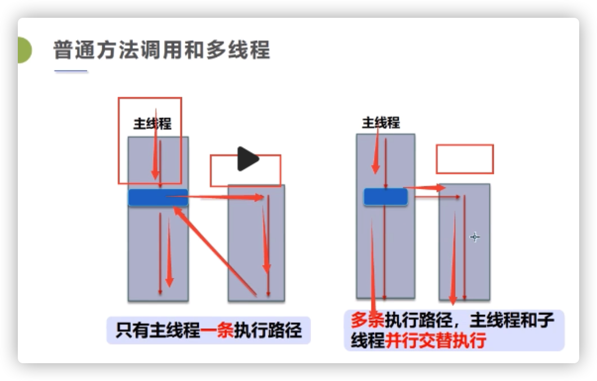
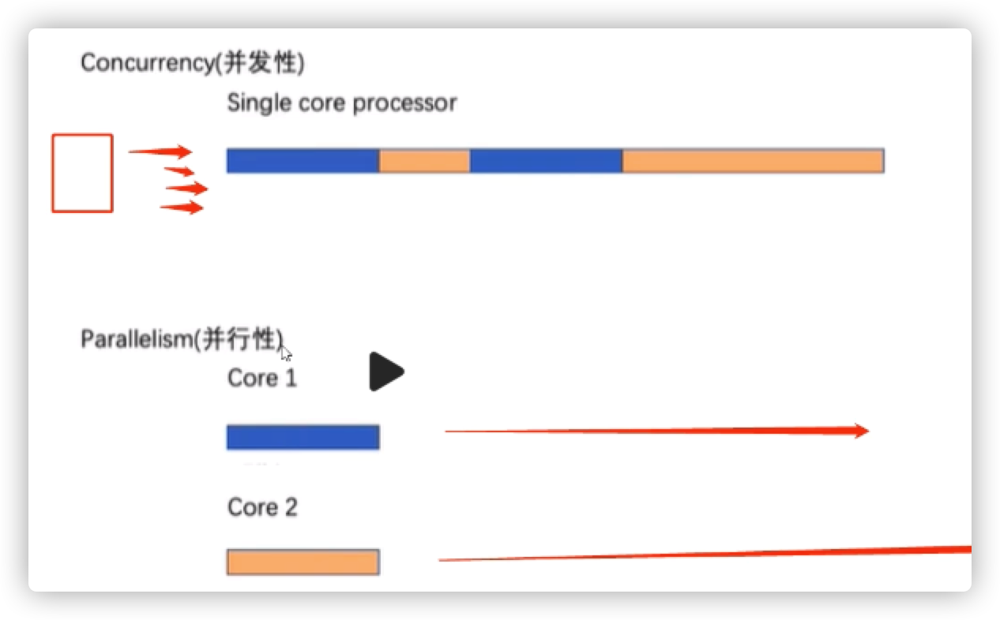
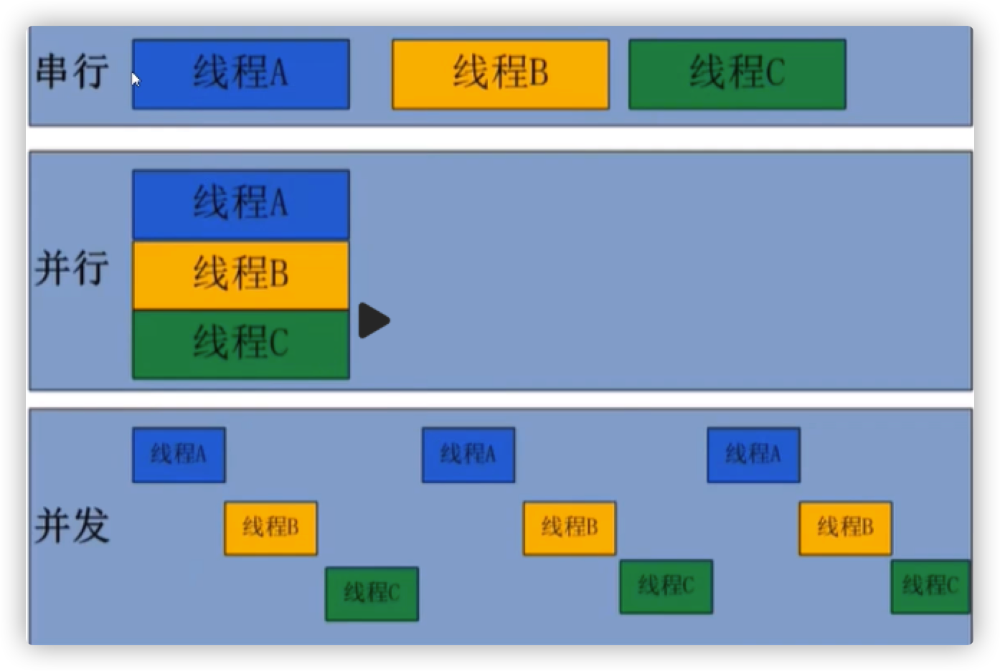
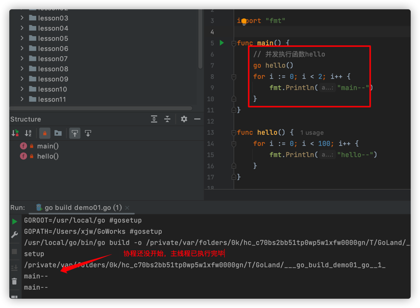
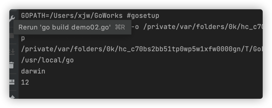
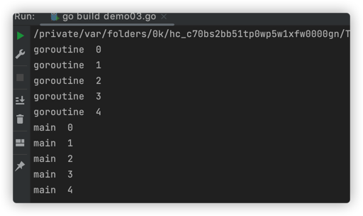
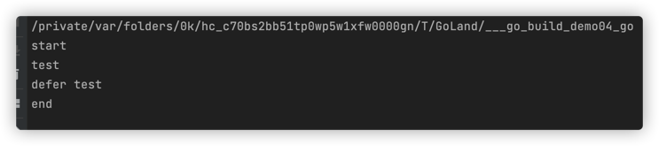
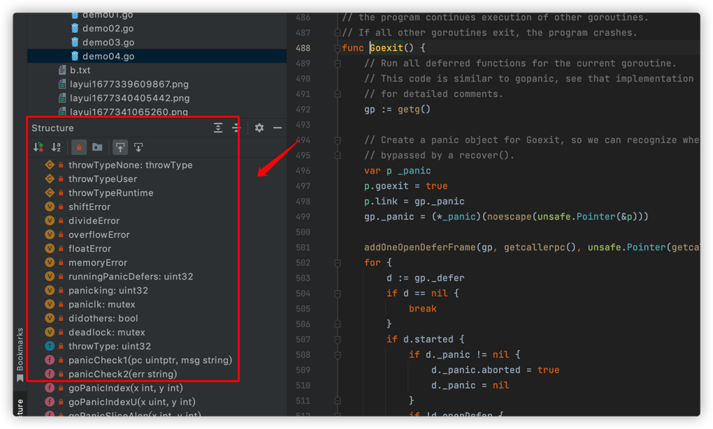
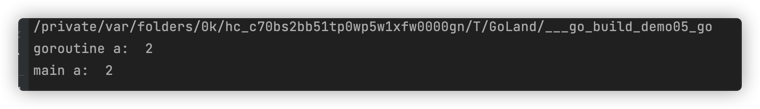

## 1、聊聊进程线程协程

### 多线程




### 程序进程与线程

操作系统中运行的程序就是进程，一个进程有多个线程，比如播放器就是一个进程，播放的声音、图像、字幕就是它的线程。

程序是指令和数据的有序集合，其本身没有任何运行的含义，是一个静态的概念

进程是程序运行的一次执行过程，是一个动态的概念，是系统资源分配的单位

通常一个进程包含多个线程，至少有一个线程，线程是CPU调度和执行的单位。

> 

### 并行和并发

并发是指多个线程在一个CPU上交替快速执行

并行是在多核cpu上分别执行两条线程，互不影响




注意：并行性parallelism不会总是更快的，因为并行运行的组件可能需要相互通信，这种通信开销很高，所以并行程序不一定是更快的。

程序有三种执行方式；




> 进程线程协程

- **进程**一般由程序、数据集、进程控制块三部分组成，我们编写的程序用来描述进程要完成哪些功能及如何完成

  数据集是程序在执行过程中所需要使用的资源，

  进程控制块用来记录进程的外部特征，描述进程的执行变化过程，系统可以用它来控制和管理进程

- **线程**是进程之后发展出来的概念，它是一个基本的cpu执行单元，也是程序执行的最小单元，由线程ID、程序计数器、寄存器集合和堆栈组成，一个进程有多个线程。

  线程的优点是减少了程序并发执行时的开销，提高了系统的并发性能；

  线程的缺点是没有自己的系统资源，同一进程的线程可以共享进程所拥有的系统资源，如果把车间比作一个进程，那么线程就好比车间里的工人。不过对于某些独占性资源存在锁机制，处理可能会产生死锁。

- **协程**是一种用户态的轻量级进程，又称微线程，英文名Goroutine.

  协称的调度完全有用户控制，人们通常将协程和函数比较，函数有一个入口，一次返回，一旦退出即完成函数的执行。通过goroutine的方式执行多个函数，实现并发。

  与传统的进程、线程相比，协程是最轻量级的，它可以轻松创建百万个而不会导致系统资源衰竭，而线程最多不能超过一万个。

<mark>Go语言靠协程来实现并发</mark>

```go
func main() {
	// 并发执行函数hello
	go hello()
	for i := 0; i < 100; i++ {
		fmt.Println("main--")
	}
}

func hello() {
	for i := 0; i < 100; i++ {
		fmt.Println("hello--")
	}
}
```

## 2、Goroutine

### 并发执行函数或方法

goroutine是与其他函数或方法同时运行的函数或方法，可以被认为是轻量级的线程，<mark>创建goroutine的成本很小，就是一段代码，一个函数入口</mark>，以及在堆上分配的一个堆栈，初始大小4k，会随着程序的执行自动增长删除。

只需在函数或方法前面执行go关键字。

注意

- 主线程不会等待协程执行完成，有可能协程还没有开始，主线程已经执行完成了

  

  

### Goroutine的规则

1. 当Goroutine调用，并且Goroutine的任何返回值被忽略，go不等待Goroutine执行结束
2. main函数中的Goroutine（主线程），先于其他Goroutine执行，如果main的Goroutine终止了，程序将被终止，而其他Goroutine将不会运行。

### 主Goroutine

**即封装main函数的Goroutine**（主线程），

1. 它首先要做的是，设定每一个goroutine所能申请的栈空间的最大尺寸，在32位计算机系统中此最大尺寸为250MB，而64位计算机系统此最大尺寸为1GB，如果某个goroutine的栈空间尺寸大于这个限制，那么运行时系统就会引发一个栈溢出stackoverflow的运行时恐慌，随后，这个go程序的运行也会终止。
2. 之后，主goroutine会进行一系列的初始化工作，大致内容如下：
   - 创建一个特殊的defer语句，用于在主goroutine退出时做必要的善后处理，因为主goroutine也可能非正常的结束
   - 启动专用于在后台清扫内存垃圾的goroutine，并设置GC可用的标识
   - 执行main包中所引用包下的init函数
   - 执行main函数
3. 执行完main函数后，它还会检查主goroutine是否引发了运行时恐慌，并进行必要的处理。
4. defer语句执行完后，程序运行完毕，主Goroutine会结束自己以及当前进程的运行。

## 3、Goroutine调度与终止

### runtime包

多线程并发执行，肯定会竞争cpu资源，runtime包它可以：

- 获取系统信息
- schedule调度让出cpu时间片，让别的goroutine先执行
- Goexit, 终止当前groutine

> 获取系统信息

```go
func main() {
	// 获取Goroot目录路径,存放项目信息
	fmt.Println(runtime.GOROOT())
	// 获取操作系统
	fmt.Println(runtime.GOOS)
	// 获取cpu数量，可以尝试做一些系统优化，开启更大的栈空间
	fmt.Println(runtime.NumCPU())
}
```




>  runtime.Gosched() 让出cpu时间片

让其他的goroutine先执行，尽可能让出cpu时间片

```go
func main()  {
	go func(){
		for i := 0; i < 5; i++ {
			fmt.Println("goroutine ",i)
		}
	}()

	for i := 0; i < 5; i++ {
		// Gosched 礼让，让出cpu时间片
		runtime.Gosched()
		fmt.Println("main " ,i)
	}
}
```




> runtime.Goexit() 终止当前goroutine

```go
func main()  {
	go func() {
		fmt.Println("start")
		runtimetest()
		fmt.Println("end")
	}()
	// 主线程 3秒钟结束
	time.Sleep(time.Second*3)
}

func runtimetest(){
	defer fmt.Println("defer test")
	fmt.Println("test")
}
```

运行结果：




增加goexit后，终止子协程

```go
func main()  {
	go func() {
		fmt.Println("start")
		runtimetest()
		fmt.Println("end")
	}()
	// 主线程 3秒钟结束
	time.Sleep(time.Second*3)
  fmt.Println("main end")
}

func runtimetest(){
	defer fmt.Println("defer test")
  // 这里只是终止了函数
  // return
  // 终止当前goroutine协程
	runtime.Goexit()
	fmt.Println("test")
}
```

运行结果：


子线程被终止，主线程继续执行

看runtime包的源码




### 临近资源

多线程共享的变量叫做临界资源

```go
func main()  {
	a:=1

	go func() {
		a =2
		fmt.Println("goroutine a: ",a)
	}()

	a=3
	time.Sleep(time.Second*2)
	fmt.Println("main a: ",a)
}
```




### 售票并发


