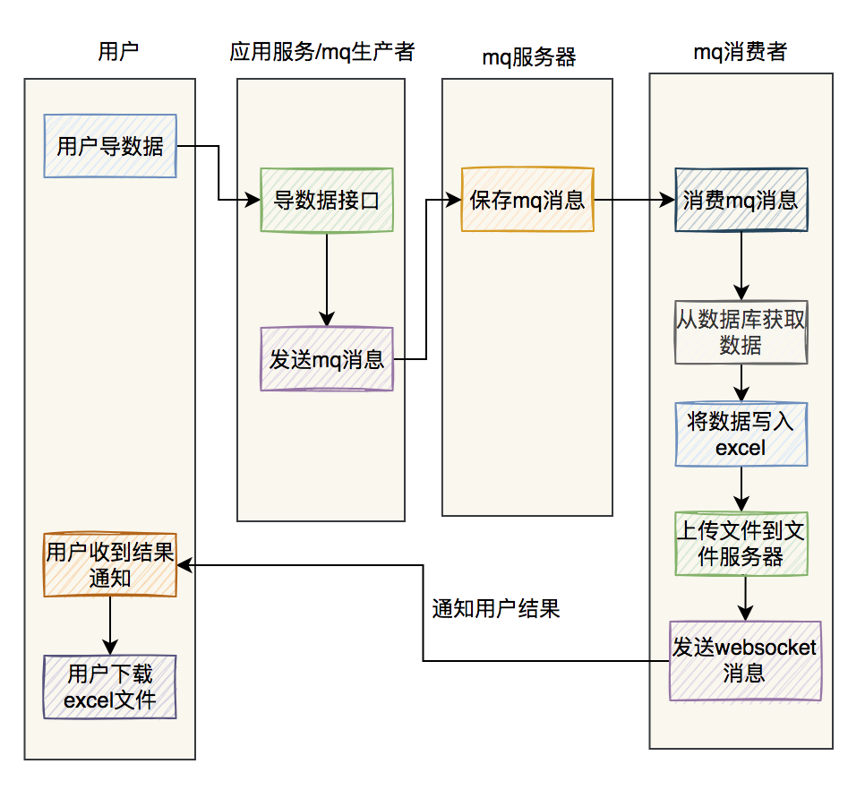

## 前言

做一个excel导出功能，导出符合条件的商品数据

你可能会面临如下问题：

1. 如果同步导出数据，接口很可能超时
2. 如果一次性把所有数据装载到内存，很容易引起OOM
3. 数据量太大，sql语句必定会很慢
4. 相同商品编号的数据要放到一起
5. 如果走异步，如何通知用户导出结果
6. 如果excel文件太大，目标用户打不开怎么办

我们要解决这些问题，下面是可行方案


## 1、异步处理

做一个百万级别的excel导出功能，如果走接口同步导出，该接口肯定会非常容易`超时`，因此我们的第一选择应该接口走`异步`处理，有三种方式

- 线程池

  服务重启，会产生数据的丢失问题

- job

  增加一张`执行任务表`，记录每次的导出任务，用户点击导出按钮，会调用后端接口，该接口会向表中写入一条记录，该记录的状态为：`待执行`；

  有个job，每隔一段时间比如5分钟，扫描一次执行任务表，查出所有状态的`待执行`的记录，然后遍历这些记录，挨个执行。

  注意：比如job每隔5分钟执行一次，但如果数据导出的功能所花费的时间超过了5分钟，在一个job周期内执行不完，就会被下一个job执行周期执行，可能会出现重复执行的情况，为防止job重复执行，需要增加一个`执行中`的状态。具体的状态变化如下：

  1. 执行任务被记录到任务表，是`待执行`
  2. 当job第一次执行该任务，状态该为：`执行中`
  3. 当job跑完了，该记录的状态变成：`完成`或`失败`

  使用job还有一个硬伤：它不是立马执行的，有一定的延迟。如果对时间不太敏感的业务场景，可以考虑该方案。

- **mq**

  用户点击导出按钮，会调用一个后端接口，该接口会向mq服务端发送一条`mq消息`。有个消费者，消费该消息，然后就可以实现excel的数据导出了。相对于job方案，mq实时性更好一些。

  对于mq消费者处理失败的情况，可以增加补偿机制，自动发起重试。RocketMQ自带了失败重试功能，如果超过了一定的阈值，则会将该消息放入`死信队列`

## 2、使用easyexcel

百万级别的excel数据导出功能，如果使用传统的Apache POI框架去处理，可能会消耗很大的内存，容易引发OOM问题，而easyexcel重写了POI对07版的解析，一个3M的excel用POI 解析，需要100M左右的内存，如果改用easyexcel可以降低到几M，并且再大的excel也不会出现内存溢出，03版依赖POI的sax模式，在上层做了模型转换的封装，让使用者更加简单方便。

Pom.xml引入依赖包

```xml
<dependency>
    <groupId>com.alibaba</groupId>
    <artifactId>easyexcel</artifactId>
    <version>3.0.2</version>
</dependency>
```

简单使用，详情请看官方网站

读取excel

```java
@Test
public void simpleRead() {
    String fileName = TestFileUtil.getPath() + "demo" + File.separator + "demo.xlsx";
    // 这里 需要指定读用哪个class去读，然后读取第一个sheet 文件流会自动关闭
    EasyExcel.read(fileName, DemoData.class, new DemoDataListener()).sheet().doRead();
}
```

写数据到excel

```java
@Test
public void simpleWrite() {
    String fileName = TestFileUtil.getPath() + "write" + System.currentTimeMillis() + ".xlsx";
    // 这里 需要指定写用哪个class去读，然后写到第一个sheet，名字为模板 然后文件流会自动关闭
    // 如果这里想使用03 则 传入excelType参数即可
    EasyExcel.write(fileName, DemoData.class).sheet("模板").doWrite(data());
}
```

easyexcel能大大减少内存占用的主要原因：在解析Excel时没有将文件数据一次性全部加载到内存中，而是从磁盘上一行行读取数据，逐个解析。

## 3、分页查询

百万级别的数据，从数据库一次性查询出来，是一件非常耗时间的工作。

- 可能数据库连接超时
- 大量数据加载到内存，也有可能导致应用出现OOM内存溢出

所以有必要分页查询，如5000条记录，分200页

```java
public Page<User> searchUser(SearchModel searchModel) {
    List<User> userList = userMapper.searchUser(searchModel);
    Page<User> pageResponse = Page.create(userList, searchModel);
    pageResponse.setTotal(userMapper.searchUserCount(searchModel));
    return pageResponse;
}
```

每页大小pageSize和页码pageNo，是SearchModel类中的成员变量，在创建SearchModel对象时，可以设置这两个参数

然后在Mybatis的sql文件中，通过limit 语句实现分页功能：

```xml
limit #{pageStart}, #{pageSize}
```

其中pageStart 是数据偏移量，通过pageNo和pageSize计算出来的

```java
pageStart = (pageNo - 1) * pageSize;
```

## 4、多个sheet

我们知道，excel对一个sheet存放的最大数据量，是有限制的，一个sheet最多可以保存1048576行数据。否则保存数据时会直接报错

```java
invalid row number (1048576) outside allowable range (0..1048575)
```

百万以上的数据，一个sheet肯定是存放不下的，因此我们需要把数据保存到多个sheet中


## 5、计算limit的起始位置

我们一般通过limit语句来实现分页查询功能的：

```java
limit #{pageStart}, #{pageSize}
```

其中pageStart是动态计算出来的，

```java
pageStart = (pageNo - 1) * pageSize;
```

如果只有一个sheet是没有问题的，但是多个sheet就会有问题，因此，我们需要重新计算limit的起始位置

```java
int totalPage = searchUserTotalPage(searchModel);

if(totalPage > 0) {
   Page<User> page = Page.create(searchModel);
   int sheet = (totalPage % maxSheetCount == 0) ? totalPage / maxSheetCount: (totalPage / maxSheetCount) + 1;
   for(int i=0;i<sheet;i++) {
      WriterSheet writeSheet = buildSheet(i,"sheet"+i);
      int startPageNo = i*(maxSheetCount/pageSize)+1;
      int endPageNo = (i+1)*(maxSheetCount/pageSize);
      while(page.getPageNo()>=startPageNo && page.getPageNo()<=endPageNo) {
        page = searchUser(searchModel);
        if(CollectionUtils.isEmpty(page.getList())) {
            break;
        }
        
        excelWriter.write(page.getList(),writeSheet);
        page.setPageNo(page.getPageNo()+1);
     }
   }
}
```

这样就能实现分页查询，将数据导出到不同的sheet中。

## 6、文件上传到OSS

我们导出excel数据的方案改成异步，无法直接将excel文件同步返回给用户，因此我们需要将文件存放到一个地方，用户有需要的时候，可以访问到。我们可以选择将文件上传到OSS文件服务器上。

通过OSS的上传接口，将excel上传成功后，会返回文件名称和访问路径，保存到表中，这样后面就可以通过浏览器访问到excel文件了。

如果将excel文件保存到应用服务器（静态资源方式访问），可能会占用较多的磁盘空间。

一般建议将应用服务器和文件服务器分开，应用服务器需要更多的内存资源和CPU资源，文件服务器需要更多的磁盘资源。

## 7、通过WebSocket推送通知

通过webSocket建立长连接，进行实时通知用户导出excel的结果，如果你使用springboot框架，直接引用webSocket的jar包依赖

```xml
<dependency>
  <groupId>org.springframework.boot</groupId>
  <artifactId>spring-boot-starter-websocket</artifactId>
</dependency>
```

我们可以加一张`通知表`,记录通过webSocket推送的通知标题、用户、附近地址、阅读状态等信息，能更好的追溯通知记录。

- webSocket给客户端推送一个通知后，用户的右上角收件箱上，实时出现一个小窗口，提示本次的导出excel功能上成功还是失败，并且有文件的下载链接，当前状态上`未读`
- 用户点击该窗口，可以看到详细内容，状态变为`已读`

## 8、总条数可配置

我们在做导百万级数据这个需求时，是给用户用的，也有可能是给运营同学用的。

其实我们应该站在实际用户的角度出发，去思考一下，这个需求是否合理。用户拿到这个百万级别的excel文件，到底有什么用途，在他们的电脑上能否打开该excel文件，电脑是否会出现太大的卡顿了，导致文件使用不了。

因此，非常有必要把记录的`总条数`，做成`可配置`的，可以根据用户的实际情况调整这个配置。

- 比如：用户发现excel中有50万的数据，可以正常访问和操作excel，这时候我们可以将总条数调整成500000，把多余的数据截取掉。
- 在`用户的操作界面`，增加更多的查询条件，用户通过修改查询条件，多次导数据，可以实现将所有数据都导出的功能，这样可能更合理一些。
- 分页查询时，`每页的大小`，也建议做成可配置的，通过总条数和每页大小，可以动态调整记录数量和分页查询次数，有助于更好满足用户的需求。

## 9、order by 商品编号

之前的需求是要将相同商品编号的数据放到一起。

例如：

| 编号 | 商品名称 | 仓库名称 | 价格 |
| :--- | :------: | -------: | :--: |
| 1    |  笔记本  |   北京仓 | 7234 |
| 1    |  笔记本  |   上海仓 | 7235 |
| 1    |  笔记本  |   武汉仓 | 7236 |
| 2    | 平板电脑 |   成都仓 | 7236 |
| 2    | 平板电脑 |   大连仓 | 3339 |

但我们做了分页查询的功能，没法将数据一次性查询出来，直接在Java内存中分组或者排序。

因此，我们需要考虑在sql语句中使用`order by` 商品编号，先把数据排好顺序，再查询出数据，这样就能将相同商品编号，仓库不同的数据放到一起。

此外，还有一种情况需要考虑一下，通过配置的总记录数将全部数据做了截取。

但如果最后一个商品编号在最后一页中没有查询完，可能会导致导出的最后一个商品的数据不完整。

因此，我们需要在程序中处理一下，将最后一个商品删除。

但加了order by关键字进行排序之后，如果查询sql中`join`了很多张表，可能会导致查询性能变差。

## 总结

最后用两张图，总结一下excel异步导数据的流程

- 使用mq导数据

  

  

- 使用job定时任务导数据

  
